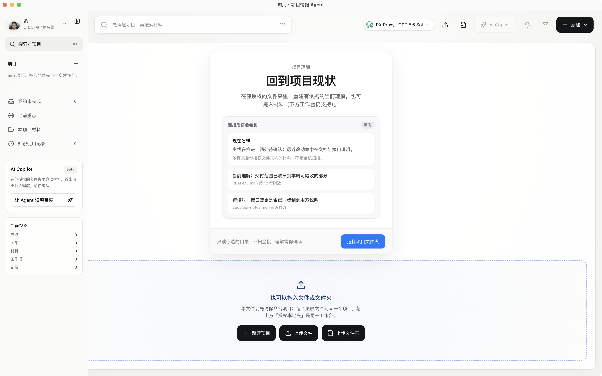
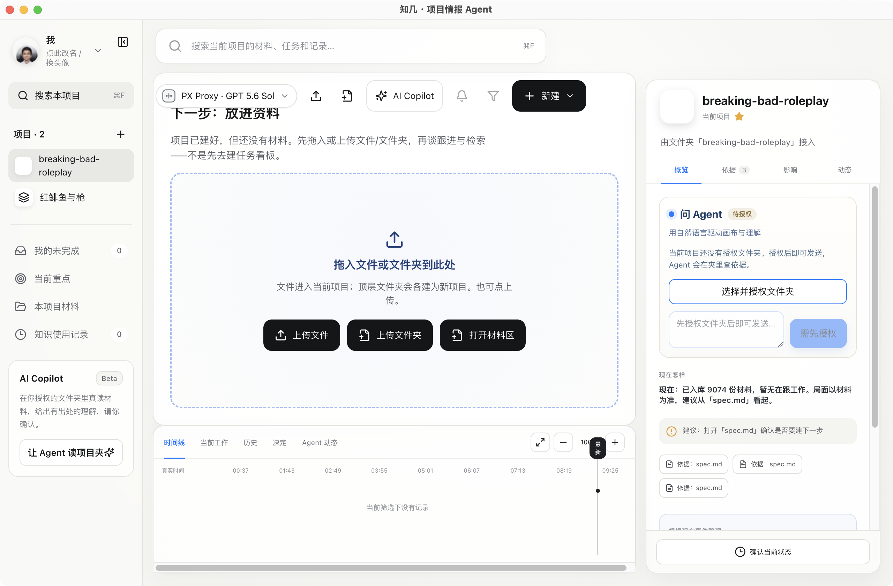
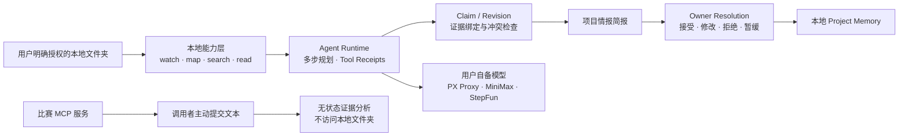

# 知几

<p align="center">
  
</p>

<p align="center">
  <strong>一个运行在本地、以证据为基础的项目情报 Agent</strong><br />
  当你重新进入复杂项目时，立刻恢复当前态势，并完成下一步决定。
</p>

<p align="center">
  参赛队伍：<strong>不俟终日</strong>　·　<a href="https://zhiji-hackathon-mcp.yishuziyu.workers.dev">比赛 MCP</a>
</p>

> 知几不是帮你看见更多，而是让你只看见此刻真正需要看见的东西。<br />
> **少看、少错、少拖。**

## 问题场景

项目真正令人疲惫的，不是文件太多，而是每次回来都要重新理解：

- 发生了什么？
- 哪些已经完成，哪些只是“有人说完成了”？
- 哪些结论有证据，哪些只是推断？
- 现在最重要的是什么？
- 我接下来到底需要决定什么？

文件工具可以保存资料，任务工具可以记录待办，普通 AI 可以总结一次对话。但当项目在代码、文档、会议记录和执行结果之间持续变化时，人的注意力很难一直跟上。

## 解决方案

知几把 Agent 的任务收窄为一个高价值、可验证的垂直切片：

> **当用户重新进入一个复杂项目时，在明确授权范围内重建项目态势，给出有证据的当前判断，并帮助用户完成下一步决定。**

它会在本地能力层搜索、读取和比较真实项目材料，再把结果收束为一份项目情报简报：

1. **项目现在怎样**：当前最重要的判断；
2. **我依据什么**：能够回到具体文件与精确 Revision 的证据；
3. **还不知道什么**：限制、冲突与未知事项；
4. **你现在只要决定**：一个真正需要 Owner 拍板的问题。

Agent 的候选理解不会自动变成项目事实，建议不会自动变成正式任务。Owner 可以逐条接受、修改、拒绝或暂缓，确认之后才写入项目记忆。

<p align="center">
  
  
</p>

## Demo 路径

比赛 Demo 使用一个真实的旧项目完成以下闭环：

1. **重新进入项目**：打开知几，选择并授权“红鲱鱼与枪”项目文件夹；
2. **真读材料**：Agent 先建立项目地图，再执行搜索与精读；界面展示真实工具过程与 Receipt；
3. **恢复态势**：画布呈现项目、材料及关系，右侧简报回答“现在怎样、依据什么、还不知道什么、需要决定什么”；
4. **继续追问**：在 Agent 对话框询问项目业务流程或数据集是否经过验证，回答仍需指回已读材料；
5. **Owner 裁决**：对关键判断逐条接受、修改、拒绝或暂缓，刷新后仍可恢复；
6. **识别项目噪音**：向授权文件夹放入一份真实但无关的“杭州旅行”Markdown，再次分析；Agent 应识别它与项目主线无关，并请求用户判断，而不是假装相关或擅自移动文件；
7. **观察变化**：时间线只记录真实发生的读取、判断与确认，形成可复盘的项目变化轨迹。

这段 Demo 要证明的不是“AI 什么都能做”，而是：**用户无需重新阅读整个项目，也能作出有依据的下一步决定。**

## 为什么它是 Agent，而不是聊天框

知几的工作合同包含完整的 Agent 闭环：

```text
触发：重新进入项目 / 材料变化 / 交付或会议前
  ↓
规划：决定先看结构、搜索什么、精读哪些材料
  ↓
行动：map / search / read / compare
  ↓
核验：Claim ↔ 精确 Revision，暴露冲突与未知
  ↓
输出：当前判断 + 关键依据 + 一个待决定问题
  ↓
监督：Owner 接受 / 修改 / 拒绝 / 暂缓
  ↓
记忆：只保存确认后的项目事实，继续观察变化
```

模型或工具调用失败时，Run 会真实失败：不生成候选理解，不进入“待确认”，也不会用旧数据冒充本轮成功。

## 工具与技术路线



| 层 | 技术与作用 |
|---|---|
| 桌面客户端 | Electron；启动本机 loopback 服务，以客户端方式提供授权夹与本地数据能力 |
| 呈现层 | Next.js 16、React 19、TypeScript；唯一产品入口 `/track/knowledge` |
| 情报画布 | React Flow + Dagre；呈现项目、材料、关系与当前关注点 |
| 本地能力层 | 文件夹授权、watch、project map、search、read、Revision 与 Receipt |
| Agent Runtime | 多步工具调用、Run 状态、幂等与恢复；失败时 fail-closed |
| 项目记忆 | JSON / SQLite 存储、Candidate、Claim、Owner Resolution 与 Accepted Understanding |
| 模型连接 | BYOK；支持 PX Proxy（GPT-5.6 Sol）、MiniMax Token Plan、StepFun Token Plan 与自定义网关 |
| 质量门禁 | Vitest、Playwright、TypeScript、桌面打包与真实黄金路径证据 |

网页只负责呈现画布、过程和确认；读取用户硬盘的能力留在本机进程，不交给云端网页。

## 比赛 MCP 服务

主办方要求提交 MCP 协议服务。知几提供了一个与桌面产品隔离的、无状态、无写入的 Streamable HTTP 比赛适配器：

- **MCP Endpoint**：[`https://zhiji-hackathon-mcp.yishuziyu.workers.dev/mcp`](https://zhiji-hackathon-mcp.yishuziyu.workers.dev/mcp)
- **服务说明 / 健康检查**：[`https://zhiji-hackathon-mcp.yishuziyu.workers.dev`](https://zhiji-hackathon-mcp.yishuziyu.workers.dev)

| Tool | 输入与输出 |
|---|---|
| `analyze_project_state` | 接收调用者主动提交的项目材料，输出当前态势、重要性、证据、未知事项和一个待决定问题 |
| `verify_claim_evidence` | 接收 Claim 与带 Revision 的证据，输出 `grounded` / `insufficient` / `conflicting` 及缺失信息 |

该服务不读取用户硬盘，不访问桌面数据库，不存储输入，不修改项目，也不接触桌面端模型密钥。其源码位于 [`mcp-service/`](mcp-service/README.md)。已使用官方 MCP SDK 验证 `initialize`、`tools/list` 和两个 `tools/call`。

## 商业化可能

知几首先服务同时推进多个复杂项目的个人、小团队 Owner，以及需要频繁交接和复盘的专业服务团队。

| 版本 | 目标用户 | 价值与收费方式 |
|---|---|---|
| 个人版 | 独立开发者、研究者、创作者、多项目负责人 | 按月订阅或活跃项目数收费，减少重新进入项目的注意力成本 |
| 团队版 | 产品、研发、运营小团队 | 按席位与项目空间收费，提供共享态势、Owner 确认与交接记录 |
| 交付版 | 咨询、软件交付、创意与代运营团队 | 面向客户项目提供可核验的进度、证据链与交付复盘 |

后续可以连接代码仓库、文档、会议与任务系统，但仍保持同一原则：连接器扩大信息边界，Owner 决定事实与行动边界。

## 快速体验

### 网页开发模式

```bash
git clone https://github.com/yishu-ziyu/zhiji.git
cd zhiji
npm install

# 可选：配置真模型，字段见 .env.example
# LLM_BASE_URL=...
# LLM_API_KEY=...
# LLM_MODEL=...

npm run dev
```

打开：[`http://127.0.0.1:3000/track/knowledge`](http://127.0.0.1:3000/track/knowledge)

### 桌面客户端

**预构建安装包（Apple Silicon）：** [Release v0.1.0](https://github.com/yishu-ziyu/zhiji/releases/tag/v0.1.0)

1. 下载 `Zhiji-0.1.0-darwin-arm64.zip` 并解压得到 `知几.app`
2. 首次打开若被拦截：右键 → 打开（未签名比赛包）
3. 在应用内填写你自己的模型 API Key（包内不含密钥）

本地构建：

```bash
npm run desktop:dev       # 开发模式
npm run desktop:package   # 生成 macOS .app
```

桌面模型配置不会打进 `.app`，演示机可按 [`docs/product/DESKTOP_ENV_SETUP.md`](docs/product/DESKTOP_ENV_SETUP.md) 配置。

## 公开实验数据与指标

知几用固定题集 + 主键指标判断「进步还是只是更漂亮」：

- **指标规范：** [`docs/product/PROJECT_INTELLIGENCE_METRICS.md`](docs/product/PROJECT_INTELLIGENCE_METRICS.md)
- **公开实验档案：** [`docs/metrics/`](docs/metrics/)（每次 `metrics:publish` 写入 run 明细，入仓公开）
- **实验日志：** [`docs/metrics/EXPERIMENT_LOG.md`](docs/metrics/EXPERIMENT_LOG.md)

```bash
npm run test:bench
npm run metrics:measure
npm run metrics:compare
npm run metrics:publish   # 生成 docs/metrics/runs/<slug>/ 并应提交到 GitHub
```

## 信任边界

- **先授权，后读取**：没有明确 Source Grant，不读取正文；
- **精确证据**：重要 Claim 必须绑定到具体 Revision，而不是只给模糊文件名；
- **候选不等于事实**：普通聊天、Candidate 和 WorkSuggestion 不会自动写成已确认真相或正式任务；
- **人类终裁**：正式事实、方向变化和高风险动作由 Owner 确认；
- **诚实失败**：模型、工具或证据不足时暴露失败与未知，不显示假进度或假成功；
- **本地优先，不作绝对承诺**：文件读取和项目数据在本机；如果用户配置远程模型，发送给该供应商的可见内容受其服务与用户配置约束。

知几不是全机监控、编辑器、微信式私聊工具，也不会擅自移动、删除用户文件。

## 当前状态

比赛候选版本当前为：**implemented / tested / packaged / ready-for-owner-recording**。

这意味着桌面包、核心门禁、真模型读夹与 Claim/Revision 黄金路径已有验证证据；但在 Owner 亲手完成最终录屏路径并确认之前，项目不会把自己标记为 `accepted`。这是知几产品原则本身的一部分：**工程完成不等于产品验收完成。**

## AI 使用与开源披露

- 产品运行模型：用户自备模型连接；比赛演示可使用 PX Proxy / GPT-5.6 Sol、MiniMax Token Plan 或 StepFun Token Plan；
- AI Coding：OpenAI Codex、Grok 多窗口协作，所有产品边界与最终判断由人类 Owner 审核；
- 开源组件：Next.js、React、Electron、React Flow、Dagre、Model Context Protocol SDK、Vitest、Playwright 等；
- 产品界面展示真实运行状态，不使用测试数据或假进度冒充 Demo 成功。

## 进一步阅读

| 文档 | 内容 |
|---|---|
| [`CONTEXT.md`](CONTEXT.md) | 产品一句话、四区结构与不做清单 |
| [`docs/product/产品清单.md`](docs/product/产品清单.md) | 唯一已完成 / 未完成台账 |
| [`docs/product/交付叙事与Agent业务逻辑.md`](docs/product/交付叙事与Agent业务逻辑.md) | 比赛故事、90 秒讲稿与 Agent 业务逻辑 |
| [`docs/product/AGENT_PRESENCE_ACCEPTANCE.md`](docs/product/AGENT_PRESENCE_ACCEPTANCE.md) | 真读夹与 Agent Presence 严格验收 |
| [`docs/product/DESKTOP_ENV_SETUP.md`](docs/product/DESKTOP_ENV_SETUP.md) | 桌面模型配置与安全边界 |

---

**不俟终日 · 知几**<br />
用最少的注意力，形成足够正确的判断，并完成下一步决定。
