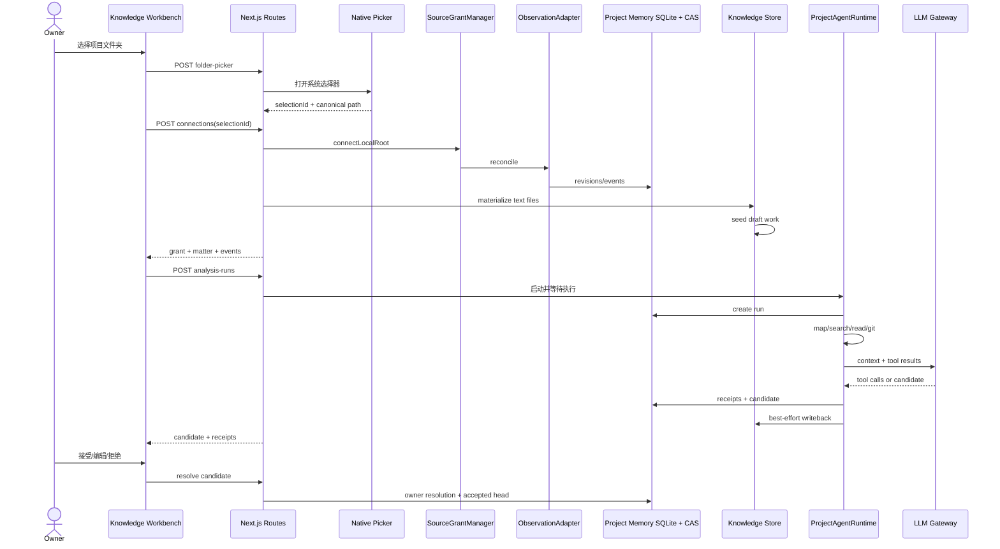
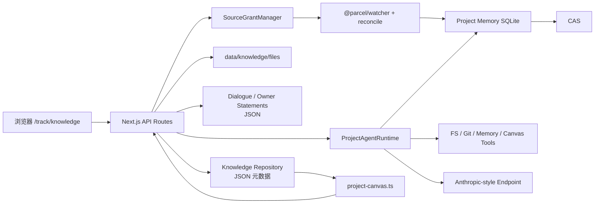
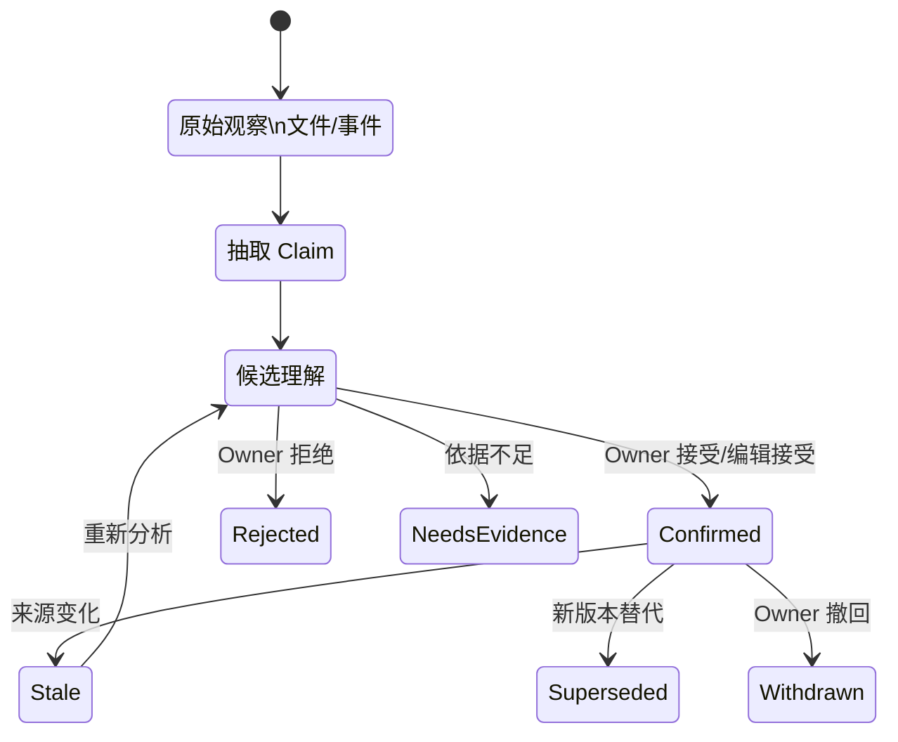
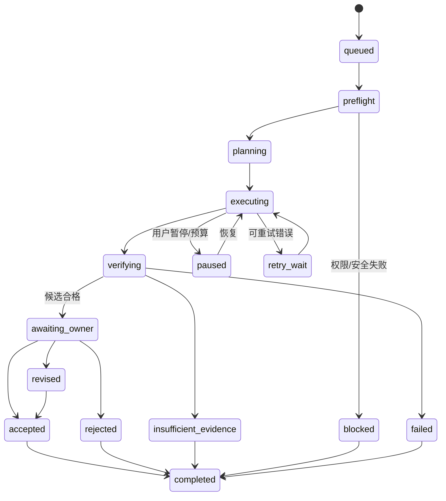
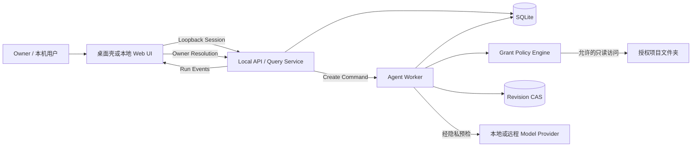
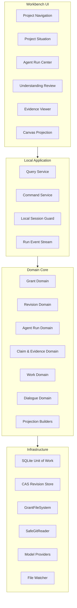
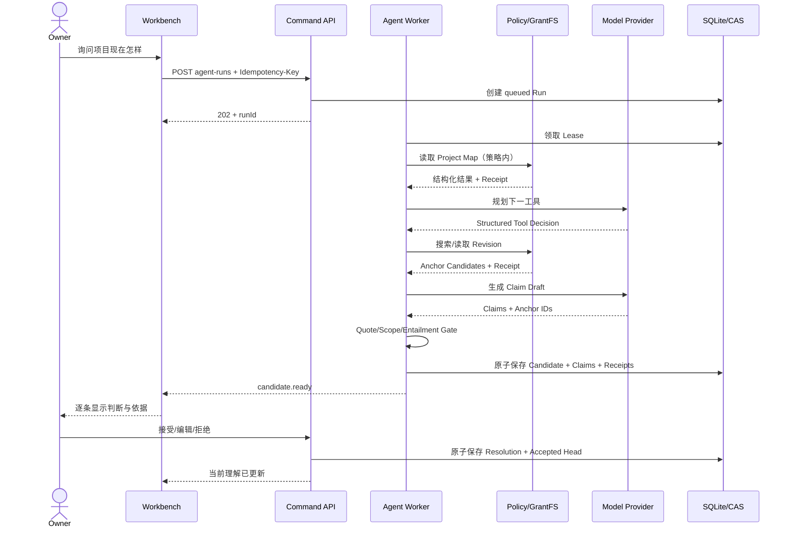
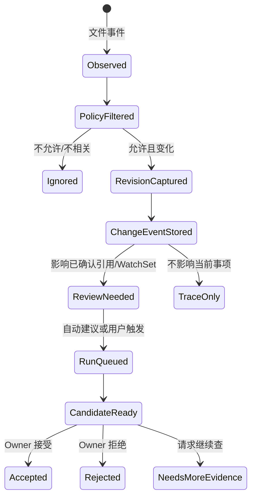
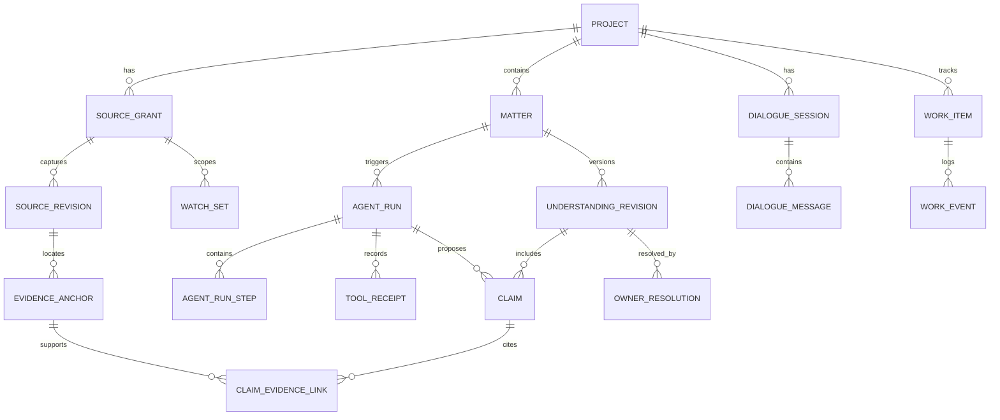

# 知几 vNext：产品与工程优化 PRD

> 文档类型：现状审计 + 产品需求文档（PRD）+ 目标架构 + 技术重构路线图 + 团队实施规范
> 审计对象：`yishu-ziyu/zhiji`
> 审计基线：`main@14ef7bf761f1f7efa339d9b9c65438571b8620b3`
> 审计日期：2026-07-16
> 文档状态：Proposal v1.0
> 目标读者：产品负责人、设计师、前端、后端、Agent/模型、QA 与技术负责人
> 默认产品边界：**macOS、本地单用户、自托管、项目文件夹驱动、证据优先**
> 审计限制：本报告通过 GitHub 仓库静态审计生成；当前执行环境无法联网克隆仓库，因此没有实际执行安装、构建、测试和真模型验收。源码结论与运行结果在本文中严格区分。

---

## 文档目录

1. 执行摘要
2. 当前产品与架构理解
3. 关键矛盾
4. 产品路线选择
5. vNext 产品 PRD
6. Agent Contract
7. 详细需求：授权、采集、工具与 Runtime（Epic A～L）
8. 目标架构
9. 当前大型文件的拆分方案
10. 目标数据模型
11. API 合同草案
12. 分阶段路线图
13. 建议的前 15 个 Pull Requests
14. 团队工作方式
15. 测试与验收矩阵
16. 风险登记表
17. Definition of Ready / Done / Release Gate
18. 文件级优化清单
19. 文档体系与 Code Wiki
20. 仍需产品负责人明确的决策
21. 建议的产品成功指标
22. 最终建议
23. 附录：运行方式、证据索引、未确认项与自检

## 0. 阅读与执行方式

这份文档不是“功能愿望池”，而是把 知几 从高质量原型推进到可持续产品的工程合同。

建议阅读顺序：

1. 产品与设计先读第 1～5 章，确认定位、用户任务、目标和非目标。
2. 技术负责人读第 6～10 章，确认 Agent Contract、数据真相与目标架构。
3. 各工程负责人按第 11～15 章拆 Epic、PR、测试与发布门禁。
4. 每次扩大功能范围前，先回看“现在不要做什么”。
5. 每个 PR 合并前执行文末 Definition of Done。

### 0.1 证据等级

- **[代码确认]**：由当前源码或配置直接确认。
- **[测试存在]**：仓库有相应测试，但本次未执行。
- **[文档声明]**：项目文档提出或声称完成。
- **[审计判断]**：根据多处源码关系得出的判断。
- **[待运行验证]**：必须本地构建、测试、性能实验或用户研究验证。
- **[建议目标]**：本文为 vNext 提出的目标，不代表当前已实现。

### 0.2 总判断

知几 已经不是“聊天框套模型”。它已经有一套值得继续投入的产品骨架：

- 用户用系统文件夹选择器授权真实项目目录；
- 观察器记录不可变文件修订与变化事件；
- Agent 在授权边界内执行地图、搜索、读取和 Git 查询；
- 结论先保存为候选理解，Owner 接受后才成为当前理解；
- 画布把项目、材料、工作项、事件和 Agent 活动投影为可点击关系；
- 对话记忆与项目记忆被概念性地区分；
- 仓库已有较强的行为式验收意识。

真正的问题不是方向错误，而是：

> **产品提出了高标准的可信 Agent 原则，但若干为了快速形成 Demo 内容的捷径正在绕过这些原则；工程结构也已接近继续叠功能会显著失控的临界点。**

vNext 的第一目标不是“更聪明”，而是让以下四条成为任何代码路径都无法绕过的约束：

1. 只读明确授权且符合策略的内容。
2. 每一条结论与支持它的证据逐条准确绑定。
3. 只有明确确认过的人类陈述才能进入项目真相。
4. 每次 Agent 运行都可暂停、恢复、审计、重放和解释。

---

# 1. 执行摘要

## 1.1 当前产品一句话定义

**知几 是一个本地优先的项目理解工作台：它在用户授权的项目文件夹内读取真实材料，形成可追溯的候选理解与下一步，并在用户确认后沉淀为可继续工作的项目记忆。**

这比“知识管理工具”“AI 笔记”“代码 Agent”更准确。

主要定位证据：

- `README.md`
- `CONTEXT.md`
- `docs/product/产品清单.md`
- `docs/product/AGENT_PRESENCE_ACCEPTANCE.md`
- `app/track/knowledge/page.tsx`

## 1.2 当前成熟度判断

| 维度 | 判断 | 说明 |
|---|---:|---|
| 产品差异化 | 4/5 | 本地授权、证据、人工确认与连续项目状态组合有辨识度 |
| 核心领域建模 | 3.5/5 | Grant、Revision、Event、Matter、Candidate、Accepted 等模型扎实 |
| Agent 可控性 | 2.5/5 | 有预算、收据和确认，但编排、恢复与工具契约不足 |
| 证据可信度 | 2/5 | 有引用机制，但存在给无证据结论自动补任意引用的风险 |
| 数据可靠性 | 2/5 | SQLite + CAS 较好，但大量核心状态仍在整文件 JSON |
| 安全与隐私 | 2/5 | 授权入口较严谨，执行侧、API 与模型外发仍有高风险缺口 |
| 前端可维护性 | 2/5 | 主页面、画布、Inspector 与 API 适配器均已大型化 |
| 测试意识 | 3.5/5 | 测试意图强，但缺 CI、契约与语义引用评测 |
| 交付与运维 | 1.5/5 | 仍以本地开发运行形态为主，缺迁移、备份、恢复和诊断体系 |

这些分数用于排序，不是对团队能力的评价。

## 1.3 必须优先处理的八个 P0

### P0-1：授权后实际采集范围可能远大于用户以为的范围

`native-folder-picker.ts` 为默认事项配置了 `.git`、`node_modules`、`.next`、`dist` 等排除项，但这些排除项属于 WatchSet。`LocalObservationAdapter.reconcile()` 的文件遍历没有接收 WatchSet，也没有单文件大小、总大小、扩展名和敏感文件策略；它先遍历并读取授权根目录，再由后续事项投影决定哪些事件参与分析。

风险：

- 大型仓库可能扫描 `node_modules`、构建产物、Git 对象和大二进制；
- CAS 可能保存用户以为被默认排除的内容；
- 连接一次项目可能造成巨大 I/O、内存和磁盘占用；
- `.env`、私钥、凭证或数据库文件可能进入项目记忆；
- UI 表达的是“排除分析”，系统行为却可能是“先读后排除”。

**要求：排除必须发生在任何读取、哈希、Revision、CAS 写入和模型上下文生成之前。**

### P0-2：Agent 文件与 Git 工具可能突破“只读授权边界”

观察器已有 `realpath` 和符号链接边界处理，但 `agent-tools.ts` 的 `read_path` 使用词法路径解析后直接读取。若授权目录内存在指向目录外的符号链接，可能读取 Root 之外的文件。

Git 工具使用 `execFile` 避免 Shell 注入，但模型可控制的 `base`、`head`、`commit` 没有先做 Git Ref 校验。以 `-` 开头的值可能被 Git 当作选项。部分 Git 选项具有文件写入副作用，因此“没有 Shell”并不等于“只读安全”。

**要求：所有文件和 Git 访问经过同一 Capability 层；Revision 先解析为 OID，禁止透传任意选项。**

### P0-3：普通聊天可能被自动提升为长期项目事实

`owner-statements.ts` 使用长度与少量正则判断一段用户话语是否“像项目理解”。大量超过六个字符、不是问候语的文本可能被持久化为 Active Owner Statement。`agent-runtime.ts` 又会在用户提问时自动调用这套逻辑，并把 Statement 并入项目理解。

以下句子都不应自动成为长期事实：

- “是不是应该先不做登录？”
- “我只是猜一下，可能是性能问题。”
- “帮我看看 README 是否过时。”
- “这个项目现在一定是给开发者用的吗？”

**要求：人说过的话不等于人确认过的项目事实。引入提议、确认、生效、替代和撤回状态机。**

### P0-4：当前引用门禁可能制造“有引用但引用不支持结论”的假可信

`agent-evidence.ts` 的 `enforceSourceBackedBody()` 在某条 `why` 缺证据时，会把任意可用 Tool Pin 附给它；`now` 缺证据时也会拿前几条 Pin 补入。当前测试主要检查路径、Revision、Quote 非空和是否在授权范围，却没有证明 Quote 在语义上支持对应 Claim。

这比没有引用更危险，因为 UI 会向用户展示虚假确定性。

**要求：引用绑定具体 Claim；Quote 必须是固定 Revision 中可精确定位的原文；禁止任意证据补齐。**

### P0-5：Agent 运行仍在单个 HTTP 请求内完成

`POST /api/knowledge/projects/[id]/analysis-runs` 直接等待完整工具循环。运行预算允许多轮模型与长墙钟时间，而 Next Route 承担整个执行。

风险：

- 请求超时或连接断开；
- 运行成功但响应丢失后重复启动；
- 无法可靠恢复；
- 取消只能在步骤之间生效；
- 多个运行占用 Web 进程；
- 无状态部署不可靠。

**要求：创建运行和执行运行分离；API 返回 `202 Accepted`，Worker 根据持久化状态执行。**

### P0-6：当前 API 是本机原型信任模型，不是可安全暴露的服务

代码搜索未发现鉴权或 Middleware。对话接口允许客户端提交 `role: "user" | "agent" | "system"`；Owner 身份也只是字符串。文件夹选择 API 可触发运行服务器上的原生 macOS 对话框。

本地单用户产品不一定需要账号系统，但仍必须：

- 只监听 Loopback；
- 拒绝非本机 Origin；
- 使用本机会话令牌；
- 防止跨站请求触发本地操作；
- 不允许客户端伪造 System、Agent 或 Owner；
- 明确禁止反向代理到公网。

### P0-7：核心数据跨 SQLite、CAS、JSON 与普通文件分散

Project Memory 使用 SQLite + CAS，方向正确；Dialogue、Owner Statements、偏好、Cards、Projects、Actions、Events、Relations、查询会话等大量状态仍通过同步读写整个 JSON 文件保存。

Dialogue 与 Owner Statement 的 JSON 解析错误会被捕获并直接返回空 Map。文件损坏可能表现为“记忆突然消失”，而不是明确故障。

**要求：所有元数据迁移到同一个版本化 SQLite；普通文件和 CAS 只保存大对象；写入必须有事务、约束、备份和迁移。**

### P0-8：本地文件发送到模型的网络边界不是一等产品流程

默认 LLM Endpoint 是本地地址，但允许任意 Base URL。工具读取的本地内容可能发送到远端模型。当前交互强调文件夹授权，却没有同等级的数据外发授权。

用户必须知道：

- 模型在本机还是远端；
- 哪些文件片段会离开设备；
- 是否经过秘密扫描和脱敏；
- Provider 是否保存请求；
- 如何切换仅本地模式；
- 本次运行实际外发了什么。

## 1.4 vNext 的可验证承诺

> 用户选择项目文件夹后，系统先展示实际读取范围；只有策略允许的文件才会被读取。Agent 每条结论都能点回支持它的精确原文。聊天不会自动变成项目事实，除非用户明确确认。分析即使中断或应用重启也能恢复；动作、模型调用、证据与人工决定都可审计。

## 1.5 当前不要做

在 P0 与 P1 完成前，不投入：

- 多 Agent 自由协作；
- 自动修改项目文件；
- 自动对外发送；
- 云端多人协作；
- 全局跨项目自动检索；
- 复杂向量数据库；
- 插件市场；
- 通用 IDE/终端执行器；
- Agent 自主接受自己的结论；
- 新增更多模型 Provider UI；
- 继续扩大自动生成正式任务的范围。

---

# 2. 当前产品与架构理解

## 2.1 核心用户任务

> 当我重新打开一个复杂项目时，希望系统根据真实文件与历史变化告诉我“现在怎样、为什么、哪里不确定、下一步是什么”，并让我核对证据后再保存为项目共识，从而不必重新翻遍所有材料。

五段流程：

1. 建立边界：选择项目文件夹。
2. 形成观察：记录文件修订和变化事件。
3. 形成候选：Agent 调工具阅读关键文件。
4. 人工定案：接受、编辑接受或拒绝。
5. 继续工作：画布展示材料、工作、变化、依据与 Agent 活动。

## 2.2 当前端到端流程



## 2.3 当前物理架构



## 2.4 关键模块与判断

| 模块 | 当前职责 | 判断 |
|---|---|---|
| `shared/project-memory/types.ts` | 领域、Run、工具与预算 | 概念扎实，单文件承载过多子域 |
| `shared/project-memory/sqlite-store.ts` | Schema、迁移、全部 PM Repository | 基础可靠，已成为大型全能 Store |
| `shared/project-memory/observer.ts` | 文件观察、稳定读取、Reconcile | 安全意识好，缺范围、体积、敏感策略 |
| `shared/project-memory/grants.ts` | 授权、Matter、WatchSet、投影 | 边界较清晰，仍直依赖完整 Store |
| `shared/project-memory/agent-runtime.ts` | 编排、Prompt、工具、预算、持久化、写回 | God Module，必须拆 |
| `shared/project-memory/agent-tools.ts` | 文件、搜索、Git、记忆、画布工具 | 契约、边界、结构化输出不足 |
| `shared/project-memory/agent-evidence.ts` | 引用可用性与补齐 | 最大可信风险之一 |
| `shared/agent-memory/*` | 对话、偏好、Owner 陈述 | 概念对，持久化与事实晋级不合格 |
| `shared/knowledge/repository.ts` | 项目、卡片、工作、关系等 | 领域与基础设施高度耦合 |
| `shared/knowledge/project-canvas.ts` | 排序、图、Inspector、Timeline | 规则丰富但集中 |
| `materialize-grant-signals.ts` | PM 到画布桥接 | 解决展示，复制真相与自动任务有副作用 |
| `app/track/knowledge/page.tsx` | 全工作台状态与交互 | 页面级状态机过度集中 |
| `folder-connection-api.ts` | 契约、HTTP、Fixture、重复类型 | 必须拆分 |
| `shared/llm/adapter.ts` | 单一模型协议 | 不是可替换模型层 |

## 2.5 必须保留的资产

1. 不可变 Original Revision + CAS。
2. Candidate 与 Accepted 分离。
3. OwnerDecisionWriter 与 Agent 能力分离的意图。
4. Tool Receipt 与 Agent Run 持久化。
5. 一次性文件夹选择令牌与服务端项目身份。
6. 观察器中的稳定读取和 `realpath` 防护。
7. “模型失败不假装读懂”的产品原则。
8. 一跳关系画布。
9. 行为式验收命名。
10. 项目“现在怎样”、证据、工作与时间线的统一工作台方向。

---

# 3. 关键矛盾

| 产品原则 | 当前实现 | 后果 |
|---|---|---|
| 人确认后才成为项目真相 | 普通聊天启发式进入 Active Statement | 试探、提问和假设污染长期事实 |
| 每条结论有来源 | 任意 Pin 可补到无证据 Claim | 有引用不等于被引用支持 |
| 只读授权范围 | 入口严谨，工具侧安全不统一 | 可能越界或产生副作用 |
| 默认排除噪音 | 排除发生在观察后 | 仍可能读取、哈希和保存 |
| 模型失败不假装理解 | Legacy Model Loop 仍可静默降级 | 配置切换重新引入假成功 |
| 项目记忆可持续 | 多个整文件 JSON | 并发、崩溃和损坏造成丢失 |
| 运行过程可见 | API 等待完整执行 | 实时、中断、恢复不可靠 |
| 契约先行 | 前端复制后端类型，`docs/api.md` 缺失 | 字段兼容逻辑不断积累 |
| 单一工作台 | PM 与 Knowledge 双写 | 真源、删除和事务不清 |

根因不是团队缺少设计意识，而是为了快速让 UI“有内容”，系统自动生成了过多语义：任务、Owner 陈述、引用和项目判断。vNext 必须在数据模型和视觉语言上彻底分开：

- 观察到的事实；
- 机器提出的建议；
- 人确认的项目状态。


# 4. 产品路线选择

## 4.1 路线 A：本地优先的个人项目理解工作台（推荐）

服务需要长期推进复杂项目的个人：独立开发者、产品经理、研究者、创作者与小团队负责人。用户把一个本地项目文件夹交给系统，Agent 帮助恢复上下文、发现变化、整理证据和确认下一步。

优点：

- 与当前 macOS Picker、SQLite、CAS 和本地文件系统高度一致；
- 数据边界清楚，差异化强；
- 不必先解决组织权限、多人冲突和云存储；
- 能把可信、连续、可追溯做深；
- 适合以代码与产品文档混合仓库作为第一垂直场景。

缺点：

- 市场边界比通用办公 Agent 小；
- 安装、模型配置和权限体验要求高；
- 需要设计桌面分发和付费模式。

## 4.2 路线 B：云端团队项目记忆平台

将项目材料上传或连接到云端，由多人和多个 Agent 维护事实、工作和决策。

优点：团队协作、订阅收入和企业审计空间更大。
缺点：当前代码必须重做租户、身份、ACL、对象存储、队列、KMS 与合规，也容易失去“本地授权、用户掌握真相”的特点。

## 4.3 路线 C：代码仓库理解 Agent

聚焦代码仓库，提供架构理解、变更影响、历史决策与任务分解。

优点：Git、项目文件和变更历史已有基础，任务更容易评测。
缺点：当前符号、关系与历史比较工具仍未真正实现，竞争也更激烈。

## 4.4 推荐决策

**采用路线 A，以“代码与产品文档混合项目”作为第一个垂直场景。**

对外主张不是“又一个代码 Agent”，而是：

> **帮你重新进入一个项目，并让每个判断都能点回原始材料。**

---

# 5. vNext 产品 PRD

## 5.1 产品愿景

让用户离开一个项目数天或数周后，重新打开工作台仍能在几分钟内回答：

1. 我上次确认的目标与下一步是什么？
2. 离开后哪些真实材料发生了变化？
3. Agent 对当前局面的判断是什么？
4. 每条判断的原始依据在哪里？
5. 哪些只是建议，哪些已由我确认？
6. 现在最值得做的一件事是什么？

## 5.2 目标用户

### 核心 Persona：长期推进复杂项目的 Owner

- 同时推进 3～10 个项目；
- 材料分散在代码、Markdown、会议记录、需求与 TODO；
- 经常在数天后重新进入项目；
- 不愿把整台电脑交给不透明的 Agent；
- 愿意确认关键结论，但不愿手工整理全部材料；
- 更看重“可核对”和“能继续工作”，而不是炫技自动化。

### 次级 Persona：项目协作者

vNext 按单用户设计，但数据结构允许未来记录不同人类 Actor；当前不做多人实时协作。

## 5.3 核心场景

### S1：第一次连接项目

用户选择文件夹后，系统在读取正文前展示：

- 授权根目录；
- 实际允许读取的文件数与总大小；
- 默认排除内容；
- 可能敏感文件；
- 模型在本地还是远端；
- 预计发送模型的内容范围。

用户确认后建立索引并形成首个候选理解。

### S2：几天后重新进入

立即看到：

- 上次确认的项目状态；
- 离开后的变化；
- 当前需要关注的一件事；
- 新 Candidate；
- 引用与覆盖范围。

### S3：向 Agent 提问

例如：“我们为什么决定先做本地文件夹，而不是上传？”

Agent 必须：

1. 把问题当作问题，不当作事实；
2. 读取已确认决策和原文；
3. 证据不足时明确说不足；
4. 给出逐条引用；
5. 不自动把问题写入项目事实。

### S4：审查候选理解

用户可以：

- 逐条看依据；
- 接受全部；
- 编辑某条后接受；
- 拒绝某条；
- 标记“假设”或“待核实”；
- 查看接受后影响哪些状态与下一步。

### S5：文件变化

系统：

- 只采集允许范围；
- 产生增量事件；
- 标记可能过期的 Confirmed Fact；
- 不自动覆盖 Accepted；
- 生成新 Candidate；
- 支持 Before / After / Evidence。

### S6：运行中断或重启

- Run 状态仍存在；
- 已完成步骤不重复；
- 从安全检查点继续；
- 无法继续时显示明确原因；
- 不生成重复候选、任务或事件。

## 5.4 目标

### G1 可信

- 所有“有依据”Claim 都有语义匹配的精确 Quote。
- 用户未确认的聊天永远不进入 Confirmed Facts。
- 被排除文件在任何阶段都不被读取、哈希、保存或外发。
- 模型、解析和工具失败不能表现为理解成功。

### G2 连续

- 每个项目保留上次确认状态、变化、候选和下一步。
- Run 可中断、恢复、重放。
- 文件移动、应用重启和模型切换不造成静默丢失。

### G3 可控

- 用户能看到计划、步骤、读取范围、数据外发和成本。
- 高影响写入必须确认。
- 用户能撤回、替代、删除和导出项目记忆。

### G4 可维护

- 核心模块职责单一；
- API 有机器可验证契约；
- CI 自动执行类型、Lint、单测、契约、安全和 E2E；
- 新工具通过能力与安全测试后才能注册。

## 5.5 非目标

vNext 不包括：

- 自动修改源项目文件；
- 任意终端命令；
- 自动发消息或调用外部业务系统；
- 多租户云部署；
- 多人实时协作；
- 多 Agent 自主协商；
- 全量语义平台；
- 插件市场；
- 通用聊天机器人；
- 自动把所有材料转为正式任务；
- 无人工确认地更新项目真相。

## 5.6 北极星指标

**Weekly Verified Continuation：每周经确认的项目继续会话数。**

定义：用户重新进入已有项目，查看至少一条真实变化或依据，确认、修订或明确拒绝一个候选状态，最终留下可执行下一步。

## 5.7 产品指标

| 指标 | 定义 | vNext 建议目标 |
|---|---|---:|
| 首次有源理解时间 | 授权确认到首个可审查 Candidate | P50 < 60 秒；P95 < 180 秒 |
| 引用精确匹配率 | Quote 能在固定 Revision 原样定位 | 100% |
| Claim-证据支持率 | 人工评测 Claim 被引用支持 | ≥95% |
| 静默数据丢失 | 损坏或并发导致无提示丢失 | 0 |
| 越权读取 | 读取排除或授权外文件 | 0 |
| Run 恢复率 | 中断后继续或进入确定终态 | ≥99% |
| 重复副作用 | 重试产生重复候选、任务、事件 | 0 |
| 首次进度反馈 | 启动后看到真实步骤 | P95 < 2 秒 |
| 项目恢复成功率 | 3 分钟内确认“现在怎样” | ≥80%，需用户研究验证 |

---

# 6. Agent Contract

## 6.1 Agent 的角色

Agent 是“项目理解提议者”，不是项目真相的拥有者。

可以：

- 在授权且允许的范围内读取；
- 搜索、比较和形成候选 Claim；
- 标记不确定、冲突与缺口；
- 提议下一步；
- 调整画布视图；
- 创建建议工作项。

不能：

- 扩大授权；
- 把聊天自动视为事实；
- 接受自己的 Candidate；
- 修改源文件；
- 执行任意 Git/Shell 写操作；
- 隐瞒模型失败；
- 用无关引用装饰结论；
- 把未读文件说成已读；
- 把规则模板说成模型理解；
- 把文件中的命令当作系统指令。

## 6.2 真相层级



| 状态 | 谁创建 | 可当事实展示 | Agent 可自动覆盖 |
|---|---|---|---|
| Observation | 系统 | 作为原始事实 | 否，不可变 |
| Extracted Claim | Agent | 否 | 可重建 |
| Proposed Claim | Agent | 否，标“建议” | 可新建版本，不覆盖 |
| Confirmed Fact | Owner | 是 | 否 |
| Stale Fact | 系统标记 | 只能标“可能过期” | 否 |
| Rejected | Owner | 否 | 否，保留审计 |
| Superseded | Owner/System | 仅历史 | 否 |
| Withdrawn | Owner | 否 | 否，保留审计 |

## 6.3 操作风险等级

| 等级 | 示例 | 策略 |
|---|---|---|
| R0 纯展示 | 切画布、折叠节点 | 自动 |
| R1 授权内读取 | 读文件、Git Log | 自动并记录 |
| R2 计算与建议 | Candidate、建议任务 | 自动但明确标候选 |
| R3 本地可逆写 | 保存草稿、关系 | 可按偏好批量确认 |
| R4 项目真相写 | 接受理解、改变工作状态 | 明确确认 |
| R5 外部/源文件副作用 | 改代码、发送、删除 | vNext 禁止 |

## 6.4 Run 状态机



规则：

- 状态与收据同事务提交；
- 每一步有时间与 Attempt；
- 外部调用有幂等键；
- API 不直接执行；
- 从最后已提交检查点恢复；
- `failed` 不得携带新 Candidate；
- `awaiting_owner` 必须携带已验证 Candidate；
- 终态不得被 Legacy 再覆盖。

## 6.5 预算

```ts
type RunBudgetPolicy = {
  maxWallTimeMs: number;
  maxModelCalls: number;
  maxToolCalls: number;
  maxDistinctFilesRead: number;
  maxBytesRead: number;
  maxBytesSentToModel: number;
  maxGitOutputBytes: number;
  maxEstimatedCostUsd?: number;
};
```

默认建议：

- 模型调用 8；
- 工具调用 24；
- 不同文件 20；
- 读取总量 2 MB；
- 发送模型 512 KB；
- 单文件 256 KB；
- 墙钟 180 秒；
- 连续无进展 2 步；
- 同一工具同参数重复 1 次后停止。

到达预算后进入 `paused` 或 `insufficient_evidence`，不能截断后继续声称完整理解。

---

# 7. 详细需求：授权、采集、工具与 Runtime

## Epic A：授权、范围与隐私

### A-01 授权前预检（P0）

选择文件夹后、读取正文前，仅用最小元数据展示：

- 文件总数估计；
- 允许、排除数量；
- 总字节估计；
- 超大文件；
- 符号链接；
- 可能敏感文件；
- Git 状态；
- 模型位置。

验收：

- 取消不创建 Grant、不写 CAS；
- 预检不读完整正文；
- 用户可查看和调整规则；
- 确认后才采集。

### A-02 统一 Source Access Policy（P0）

```ts
type SourceAccessPolicy = {
  include: GlobRule[];
  exclude: GlobRule[];
  maxFileBytes: number;
  maxTotalBytes: number;
  allowedKinds: SourceKind[];
  followSymlinks: "never" | "inside_root_only";
  sensitivePatterns: SensitivePattern[];
};
```

验收：

- 排除文件从未调用 `readFile`；
- 不写 Hash、Revision、Event、CAS 或 Material；
- Watch、Reconcile、Tool Read 行为一致；
- 路径先 `realpath`；
- 策略修改产生版本与 Owner 收据。

### A-03 模型数据外发确认（P0）

首次使用远端模型独立展示 Provider、Endpoint 主机、发送内容、秘密脱敏和本地模式。

验收：

- 文件授权不等于外发授权；
- 未确认时只能本地模型或停止；
- 每个 Run 可查看实际外发路径、字节和脱敏摘要；
- Endpoint 变化需重确认；
- 远端禁止明文 HTTP，Loopback 除外。

### A-04 撤销、删除与导出（P1）

支持停止 Watch、撤销 Grant、删除索引/CAS、保留或删除 Confirmed Facts、导出审计包、查看磁盘占用。

## Epic B：采集、索引与覆盖

### B-01 增量 Manifest（P0）

保存 Path、Real Path Hash、Size、MTime、Content Hash、Policy Version、Last Revision、Sensitivity 与 Index Status。Reconcile 先比元数据，仅变化文件读正文。

### B-02 覆盖报告（P0）

显示：

- 已发现；
- 策略允许；
- 已读取；
- 已索引；
- 已发送模型；
- 进入理解；
- 被排除；
- 无法读取；
- 因预算未读。

用户不能把“读了 6 个文档”误认为“读完仓库”。

### B-03 文件夹移动与项目身份（P1）

绝对路径派生项目 ID 会在移动后产生新项目。二选一：

1. 可选 `.fc-opc/project.json` Portable ID；
2. 纯只读模式下以内容指纹、Git Remote 与用户确认迁移身份。

### B-04 内容处理器（P1）

注册 Markdown/Text、Source Code、JSON/YAML、PDF、Image、Audio、Binary Metadata。未解析文件明确显示“未解析”，不能只凭文件名参与语义判断。

## Epic C：安全工具平台

### C-01 Tool Registry（P0）

```ts
interface ToolDefinition<I, O> {
  name: string;
  version: string;
  risk: "R0" | "R1" | "R2";
  inputSchema: Schema<I>;
  outputSchema: Schema<O>;
  requiredCapabilities: Capability[];
  execute(input: I, ctx: ToolContext): Promise<O>;
}
```

未实现工具不能进入模型工具清单；禁止“类型声明有、Executor 返回 not_implemented”。

### C-02 统一 `GrantFileSystem`（P0）

提供 `listTree`、`stat`、`readText`、`readBytes`、`searchText`、`openRevision`。统一执行：

- Realpath；
- Symlink；
- Policy；
- 大小预算；
- 编码；
- AbortSignal；
- 审计；
- 敏感内容处理。

Agent Tool 生产路径禁止直接 `fs.readFileSync`。

### C-03 Safe Git Reader（P0）

只开放 `status`、`log`、`diff`、`show`、`blame`。Revision：

1. 不得以 `-` 开头；
2. 字符白名单；
3. `git rev-parse --verify --end-of-options`；
4. 后续只用 OID；
5. 资源限制；
6. 禁止任意选项；
7. 记录模板而非模型原字符串。

### C-04 结构化工具输出（P0）

```ts
type SearchTextOutput = {
  query: string;
  matches: Array<{
    relativePath: string;
    revisionId: string;
    lineStart: number;
    lineEnd: number;
    excerpt: string;
  }>;
  truncated: boolean;
  scannedFiles: number;
  skippedFiles: number;
};
```

Prompt、UI、测试共同使用。

### C-05 Prompt Injection 防护（P0）

文件、Git Message、对话与 Tool Output 全标 `untrusted_content`。策略检查 Tool Call 是否符合计划、Capability、预算和目标，是否因不可信内容突然要求读取秘密或扩大范围。

## Epic D：持久化 Agent Runtime

### D-01 异步创建 Run（P0）

```http
POST /api/v1/projects/{projectId}/agent-runs
Idempotency-Key: <uuid>
```

返回 `202 Accepted`、`runId`、`queued` 和 Event Stream URL。

### D-02 Worker + Lease（P0）

Web 进程接收命令；Worker 从 SQLite 领取 Lease、续租、按 Step 事务提交。进程崩溃后可重领。一个项目默认只允许一个会改变 Candidate 的 Run。

### D-03 真实流式事件（P0）

```ts
type AgentRunEvent =
  | { type: "run.status"; status: RunStatus }
  | { type: "plan.created"; steps: PlanStep[] }
  | { type: "tool.started"; receiptId: string; tool: string }
  | { type: "tool.finished"; receiptId: string; summary: string }
  | { type: "evidence.added"; claimId: string; anchorId: string }
  | { type: "candidate.ready"; candidateId: string }
  | { type: "run.failed"; error: PublicError };
```

UI 禁止用定时器假装步骤推进。

### D-04 幂等与响应丢失（P0）

相同 `Idempotency-Key + Project + Request Hash` 返回同一 Run，不重复 Candidate、Agent Message、建议任务或 Event。必须测试“服务端完成但响应丢失”。

### D-05 恢复（P0）

每步保存输入/输出 Hash、Budget、Model Receipt、下一状态、Retry。启动时不得一律把 `running` 标失败；判断检查点能否恢复。

### D-06 Provider 中立模型层（P1）

```ts
interface ModelProvider {
  id: string;
  capabilities: {
    structuredOutput: boolean;
    toolCalling: boolean;
    usage: boolean;
  };
  complete(req: ModelRequest, signal: AbortSignal): Promise<ModelResponse>;
}
```

记录 Provider、Model、Endpoint Host、Request ID、Token、Latency、Finish Reason、Cost、Retry 与 Fallback，禁止硬编码 Provider。

### D-07 禁用隐式模板降级（P0）

确定性理解只用于测试或明确的“规则摘要”模式，UI 必须标记。Model 模式失败不得生成外观相同的理解 Candidate。


## Epic E：Claim–Evidence 可信度与人工确认

这一 Epic 是 vNext 的产品核心。没有它，项目只能证明“Agent 找到了某些文件”，不能证明“Agent 的每一句判断都被正确证据支持”。

### E-01 以 Claim 为一等对象（P0）

当前 `UnderstandingBody` 把 `now.text`、`why[].text` 等自然语言和 Evidence 数组混在一起，粒度太粗。目标模型必须把可验证判断拆成独立 Claim：

```ts
type ClaimKind =
  | "current_state"
  | "historical_state"
  | "change"
  | "causal_hypothesis"
  | "constraint"
  | "decision"
  | "next_step";

type Claim = {
  id: string;
  runId: string;
  projectId: string;
  matterId: string;
  kind: ClaimKind;
  text: string;
  confidence: "high" | "medium" | "low";
  epistemicStatus:
    | "supported"
    | "partially_supported"
    | "unsupported"
    | "conflicted"
    | "owner_stated";
  evidenceLinks: ClaimEvidenceLink[];
  conflictClaimIds: string[];
  createdAt: string;
};
```

要求：

- 一条 Claim 只表达一个可判断命题；
- `next_step` 必须说明是 Agent 建议，不得伪装成已确认计划；
- 因果判断默认 `causal_hypothesis`，除非材料明确记录因果；
- Owner 说法使用 `owner_stated`，不能自动改成 `supported`；
- 同一段摘要可以由多条 Claim 渲染，但不能只保存最终大段文字。

### E-02 证据锚点必须精确到版本与位置（P0）

```ts
type EvidenceAnchor = {
  id: string;
  projectId: string;
  grantId: string;
  revisionId: string;
  relativePath: string;
  contentHash: string;
  locator:
    | { type: "line_range"; start: number; end: number }
    | { type: "byte_range"; start: number; end: number }
    | { type: "json_pointer"; pointer: string }
    | { type: "document_block"; blockId: string };
  quote: string;
  quoteHash: string;
  verifiedAt: string;
};
```

验收标准：

- 点击引用打开的必须是引用时的 Revision，不是当前磁盘最新版；
- 路径、内容 Hash、引用文本 Hash 都可核对；
- 文件改动后旧引用仍可打开，并标记“来源已有新版本”；
- 删除源文件不会删除已确认理解的历史依据；
- 禁止 `path:<relativePath>` 之类不能稳定追踪的伪 Revision 进入 Accepted Truth。

### E-03 Claim–Evidence Link 必须说明支持关系（P0）

```ts
type ClaimEvidenceLink = {
  claimId: string;
  anchorId: string;
  relation: "supports" | "contradicts" | "context_only";
  rationale: string;
  entailmentScore?: number;
  verifiedBy: "rule" | "model" | "owner";
};
```

当前“如果 Claim 没引用，就补一个可用 Pin”的逻辑必须删除。Evidence Gate 改为：

1. Claim 自己声明它引用的 Anchor；
2. Anchor 必须来自本 Run 的真实 Tool Receipt 或已接受历史 Revision；
3. 检查 Quote 确实存在于 Revision；
4. 检查 Claim 与 Quote 的语义支持关系；
5. 不通过则降级为 `unsupported` 或 `partially_supported`；
6. UI 明确展示“不足”而不是偷偷补引用。

### E-04 语义支持评测（P0）

至少建立 100 条标注样本：

- 直接支持；
- 部分支持；
- 只提供背景、不支持结论；
- 与结论矛盾；
- 同名概念但不同上下文；
- 引用来自错误版本；
- 引用截断导致语义反转；
- 数值、日期、主体不一致；
- 因果关系被误当相关关系；
- Owner 说法与文件冲突。

自动 Gate：

- Quote Integrity = 100%；
- Revision Scope Integrity = 100%；
- Supported Claim Precision ≥ 95%；
- Unsupported Claim Recall ≥ 90%；
- 冲突检测 Recall 在基准集 ≥ 85%；
- 任何已确认事实出现“引用不存在”视为阻断发布。

模型评判只能作为一个信号；数值、日期、路径、版本等优先用确定性规则。

### E-05 Owner Statement 明确捕获（P0）

删除“普通聊天自动成为项目真相”的默认行为，改成三种明确动作：

1. **仅本次对话使用**：默认。
2. **记为项目背景**：用户点击或明确命令后创建 `OwnerStatementCandidate`。
3. **确认项目事实/决策**：用户审核文本、范围和冲突后正式接受。

```ts
type OwnerStatementCandidate = {
  id: string;
  projectId: string;
  sourceMessageId: string;
  proposedText: string;
  scope: "matter" | "project";
  conflicts: string[];
  status: "proposed" | "accepted" | "rejected" | "withdrawn";
};
```

界面文案示例：

> “这句话看起来会影响项目判断。是否把它记为项目背景？”

禁止后台静默写入。

### E-06 候选理解的人工确认界面（P0）

用户确认的不是一整块不可拆摘要，而是：

- 当前判断；
- 发生的变化；
- 未知与冲突；
- 建议下一步；
- 每条判断对应引用。

支持：

- 接受全部；
- 逐条接受/拒绝；
- 编辑后接受；
- 标记“证据不支持”；
- 要求 Agent 继续查某个问题；
- 暂存但不进入当前真相。

“接受”必须生成不可变 Resolution，记录旧文本、新文本、接受者、时间、引用版本和原因。

### E-07 冲突优先，而不是合并掩盖（P0）

当 Owner Statement、Accepted Claim、新文件、不同文件或不同时间版本冲突时：

- 不自动挑一个真相；
- 生成 `ConflictSet`；
- 显示冲突各方及时间；
- 建议最小确认问题；
- 未解决前相关 Claim 不得为 `high confidence`；
- 任何依赖该冲突的工作建议都标记风险。

### E-08 可信度用户指标（P1）

记录：

- 用户打开引用率；
- 用户判定“引用不支持”的比例；
- Candidate 接受、编辑接受、拒绝比例；
- 被接受 Claim 的平均证据数；
- 因冲突而暂停的 Run 比例；
- Accepted Truth 被后续撤销比例；
- 用户发现错误所需点击数。

目标不是把接受率做高，而是降低“错误被轻易接受”的概率。

---

## Epic F：统一数据真相、迁移与恢复

### F-01 收敛为一个版本化 SQLite 数据层（P0）

当前 Project Memory 使用 SQLite + CAS，而项目、卡片、工作项、事件、关系、对话、用户偏好和 Owner Statements 大量使用整文件 JSON。目标：

- SQLite 保存所有结构化元数据；
- CAS 保存不可变原始 Revision；
- Materials 保存用户主动导入的可预览副本，或改为对 CAS 的引用；
- Repository 通过事务接口访问；
- JSON 只用于导入导出、Fixture 与调试快照。

建议表域：

- `projects`
- `source_grants`
- `grant_policies`
- `source_revisions`
- `change_events`
- `matters`
- `watch_sets`
- `agent_runs`
- `agent_run_steps`
- `tool_receipts`
- `claims`
- `evidence_anchors`
- `claim_evidence_links`
- `understanding_revisions`
- `owner_resolutions`
- `dialogue_sessions`
- `dialogue_messages`
- `owner_statement_candidates`
- `work_items`
- `work_events`
- `knowledge_cards`
- `knowledge_relations`
- `project_checkpoints`
- `outbox_events`
- `schema_migrations`

### F-02 Repository 端口与事务边界（P0）

禁止一个巨大 Store 类实现所有职责。拆成：

```ts
interface UnitOfWork {
  projects: ProjectRepository;
  grants: GrantRepository;
  revisions: RevisionRepository;
  runs: AgentRunRepository;
  claims: ClaimRepository;
  dialogue: DialogueRepository;
  work: WorkRepository;
  commit(): Promise<void>;
  rollback(): Promise<void>;
}
```

关键事务：

- Candidate + Claims + Anchors + Run Status 同事务提交；
- Owner Accept + Accepted Head + Resolution + Outbox 同事务；
- Work Item Patch + Work Event 同事务；
- Grant Revoke + Active Run Interrupt 同事务或通过 Outbox 保证最终一致；
- Import Migration 每个版本可重入。

### F-03 正式 Migration（P0）

使用顺序迁移版本，例如：

```text
0001_initial.sql
0002_agent_runs.sql
0003_claim_evidence.sql
0004_dialogue_memory.sql
```

每次启动：

- 检查 Schema Version；
- 备份数据库；
- 在事务中迁移；
- 失败自动回滚；
- 记录 Migration Receipt；
- 禁止通过散落 `ensureColumn()` 隐式改变 Schema。

### F-04 JSON → SQLite 一次性迁移（P0）

迁移器必须：

- 只读旧 JSON；
- 校验每条对象；
- 对损坏文件停止并给出诊断，不能静默当空数据；
- 生成导入计数、跳过项、冲突、Hash；
- 支持 Dry Run；
- 支持重复运行而不重复创建；
- 迁移成功后保留只读备份；
- 用户可以导出迁移报告。

### F-05 数据损坏不得静默（P0）

当前多个 JSON Store 在解析失败时返回空 Map。vNext 统一错误：

```ts
type DataIntegrityError = {
  code: "DB_CORRUPT" | "JSON_CORRUPT" | "CAS_MISSING" | "HASH_MISMATCH";
  objectType: string;
  objectId?: string;
  recoveryActions: string[];
};
```

产品行为：

- 进入只读恢复模式；
- 不允许用空数据覆盖损坏数据；
- 给出备份/修复/导出选项；
- 记录诊断包但不包含未经许可的原文。

### F-06 备份、恢复和可移植导出（P1）

本地产品必须提供：

- 自动滚动备份；
- 手动“创建恢复点”；
- 数据库完整性检查；
- CAS 引用完整性检查；
- 一键恢复到某恢复点；
- 项目级导出；
- 全工作台加密导出；
- 可验证 Manifest（Schema、Hash、对象数）。

### F-07 数据保留策略（P1）

用户可配置：

- 原始 Revision 永久/90 天/30 天；
- Agent Tool Detail 保留多久；
- 对话保留多久；
- 模型输入是否保存；
- 被撤销 Grant 的 CAS 内容何时清除；
- 删除项目时是逻辑删除、延迟清除还是立即清除。

已进入 Accepted Truth 的引用，删除前必须提示会破坏哪些历史判断。

---

## Epic G：工作台 UX 重构

### G-01 明确产品主循环（P0）

目标主循环只保留六步：

1. 选择或继续项目；
2. 审核授权范围；
3. Agent 显示真实读取过程；
4. 查看“现在怎样”与证据；
5. 确认/修改项目理解；
6. 推进一个明确下一步。

任何主屏组件都必须服务其中一步。原始日志、内部 ID、全量材料、未使用控制项退到二级界面。

### G-02 前端按 Domain Slice 拆分（P0）

`app/track/knowledge/page.tsx` 不再直接管理所有状态和请求。建议：

```text
app/track/knowledge/
├── page.tsx
├── WorkbenchShell.tsx
├── domains/
│   ├── project-navigation/
│   ├── grant-onboarding/
│   ├── project-situation/
│   ├── evidence-viewer/
│   ├── understanding-review/
│   ├── agent-run/
│   ├── work-items/
│   ├── dialogue/
│   └── canvas/
├── api/
├── state/
└── fixtures/
```

每个 Domain Slice 包含组件、Hook、Query Key、Mutation、类型、测试；跨域只通过公开入口引用。

### G-03 Server State 与 UI State 分离（P0）

使用仓库已安装但当前未真正利用的 TanStack Query 管理：

- Project List；
- Snapshot；
- Materials；
- Work Items；
- Agent Run；
- Dialogue；
- Candidate Review。

本地 UI State 才使用组件 State 或小型 Store：

- 当前面板；
- 临时筛选；
- Draft；
- Canvas View；
- Inspector 展开状态。

删除手写 Request Counter、重复 Loading/Error State 和大量手动 Refresh。

### G-04 Agent Run Center（P0）

右侧存在感区改成真实 Run Center：

- 当前目标；
- 已允许的范围；
- 当前步骤；
- 已读文件数/总预算；
- 最近 Tool Receipt；
- 当前发现；
- 等待确认；
- 暂停/继续/停止；
- 失败原因和恢复操作；
- 完成后生成 Candidate Review。

用户能区分：

- Agent 正在读取；
- Agent 正在推理；
- Agent 已生成建议；
- Agent 正在等待自己；
- Agent 已失败；
- Agent 已被停止。

### G-05 Evidence Review 体验（P0）

点击 Claim 时：

- 只高亮该 Claim 的支持/矛盾证据；
- 打开精确版本与行范围；
- 对比当前版本；
- 显示为什么这段支持该结论；
- 用户可点“支持”“不支持”“只算背景”；
- 可把反馈写入评测集。

禁止在用户点击一个 Claim 时展示一堆不相关材料。

### G-06 Honest Empty / Partial / Error States（P0）

至少设计：

- 尚未授权；
- 授权目录为空；
- 全部文件被策略排除；
- 只有不支持格式；
- 模型不可用但材料可浏览；
- 证据不足；
- 发生冲突；
- 数据损坏进入只读恢复；
- Run 被暂停；
- Grant 已撤销；
- 引用来源已删除。

每个状态只给一个首要动作。

### G-07 工作项默认只建议、不自动污染（P0）

连接文件夹后不再自动生成多条正式 `todo` 并重排已有标题。改为 `WorkSuggestion`：

```ts
type WorkSuggestion = {
  id: string;
  projectId: string;
  title: string;
  nextStep: string;
  evidenceIds: string[];
  reason: string;
  status: "proposed" | "accepted" | "dismissed";
};
```

用户接受后才创建 Work Item。可提供“接受这 1 条”而不是默认一次生成 5 条。

### G-08 画布定位（P1）

画布是“当前关系的可视投影”，不是产品唯一导航。规则：

- 项目中心最多展示 5～9 个一跳节点；
- Edge 只来自真实关系或明确的派生规则；
- Agent 改变的是 View，不改变 Truth；
- 当前重点、证据、工作、冲突使用不同视觉层级；
- 原始材料库仍通过列表/搜索进入；
- 无关系时不强行画满。

### G-09 无障碍与键盘流（P1）

支持：

- 全键盘完成选择项目、打开证据、接受/拒绝 Claim；
- Screen Reader 描述节点、边、状态；
- 不以颜色作为唯一状态；
- Reduce Motion；
- Focus 管理；
- 大字体；
- 中英文长路径截断与复制。

### G-10 本地产品诊断页（P1）

展示但默认不上传：

- App/Schema 版本；
- 数据目录；
- 数据库大小与 Integrity；
- CAS 大小；
- 当前 Grant；
- Watcher 状态；
- 模型 Provider；
- 最近失败 Run；
- Export Support Bundle；
- 清理缓存与重建索引。

---

## Epic H：API、身份与本地信任边界

### H-01 先冻结部署形态（P0）

vNext 明确：

- 默认只监听 `127.0.0.1`；
- 只支持 macOS 本机用户；
- Native Folder Picker 只能由本机同源 UI 调用；
- 不声称支持 Vercel、Serverless、多实例或远程团队；
- 若需要局域网/远程访问，必须进入单独安全项目。

### H-02 本地会话令牌与 Origin 校验（P0）

即便单用户本机，也应：

- 启动生成随机 Session Secret；
- 页面通过 HttpOnly SameSite Cookie 获取；
- 所有写操作校验 CSRF Token/Origin；
- Native Picker 和 Grant API 需要 Session；
- WebSocket/SSE 校验同一会话；
- 拒绝非 Loopback Host；
- 对敏感操作记录 Local Actor ID。

这不是完整多用户鉴权，而是防止恶意网页跨站调用本地服务。

### H-03 服务端角色不可由客户端指定（P0）

Dialogue API：

- 客户端只能提交 User Message；
- `agent`、`system` 消息只能由服务端 Runtime 写入；
- Owner Resolution Actor 来自 Local Session，不接收任意字符串；
- Cross-project Approver 由服务端身份生成；
- Tool Receipt 和 Model Receipt 永远不可通过普通 API 伪造。

### H-04 版本化 API 与 Runtime Schema（P0）

统一 `/api/v1`。请求与响应使用共享 Schema 验证；错误格式：

```ts
type ApiError = {
  error: {
    code: string;
    message: string;
    retryable: boolean;
    details?: Record<string, unknown>;
    correlationId: string;
  };
};
```

禁止通过中文错误文本 `includes()` 判断 HTTP Status。

### H-05 OpenAPI 与契约测试（P0）

自动生成并维护：

- 路由；
- 方法；
- Schema；
- 状态码；
- 幂等要求；
- 权限；
- SSE Event；
- 示例。

前端 API Client 由契约生成或至少从同一 Schema 推导，删除 `folder-connection-api.ts` 中重复的后端类型与兼容猜测。

### H-06 权限矩阵（P0）

| 能力 | Agent | Owner UI | System Worker |
|---|---:|---:|---:|
| 读取授权文件 | 在 Run Capability 内 | 可查看 | 仅索引任务 |
| 扩大授权范围 | 否 | 明确确认 | 否 |
| 生成 Candidate | 是 | 可手工创建 | 是 |
| 接受项目真相 | 否 | 是 | 否 |
| 创建正式 Work Item | 仅建议 | 是 | 否 |
| 撤销 Grant | 否 | 是 | 执行清理 |
| 跨项目引用 | 仅建议 | 明确批准 | 校验/记录 |
| 发送外部数据 | 默认否 | 逐次或策略批准 | 按政策执行 |

### H-07 速率、负载与防滥用（P1）

即使本地也限制：

- 同项目并发 Run；
- Native Picker 调用频率；
- Material 上传大小；
- Request Body 大小；
- Dialogue 长度；
- Tool Search Query；
- SSE 连接；
- 模型预算。

### H-08 云化前置门（Won't for vNext）

只有完成以下内容才讨论云化：

- 真正用户/租户身份；
- 每租户加密和数据隔离；
- Remote Connector 安全模型；
- Secret 管理；
- 队列和多实例 Lease；
- Data Residency；
- 审计导出；
- 删除与合规；
- 远程浏览器与本地文件授权的重新设计。


## Epic I：模型、Prompt 与上下文工程

### I-01 模型能力与业务能力解耦（P0）

定义业务接口，而不是在业务模块里直接调用 `complete()`：

```ts
interface ProjectUnderstandingModel {
  plan(input: PlanningInput, signal: AbortSignal): Promise<Plan>;
  decideNextTool(input: ToolDecisionInput, signal: AbortSignal): Promise<ToolDecision>;
  synthesizeClaims(input: ClaimSynthesisInput, signal: AbortSignal): Promise<ClaimDraft[]>;
  judgeEvidence(input: EntailmentInput, signal: AbortSignal): Promise<EntailmentResult>;
}
```

Provider Adapter 只负责：

- 协议；
- 鉴权；
- Structured Output；
- Tool Calling；
- Retry；
- Usage；
- Streaming；
- Provider Error 映射。

业务层不得知道 `/v1/messages`、`anthropic-version` 或某个默认模型名。

### I-02 Structured Output + Runtime Validation（P0）

`extractJson()` 的“首个 `{` 到末个 `}`”策略只可留作调试兼容，不可作为核心协议。目标：

- Provider 支持时使用原生 JSON Schema；
- 不支持时强制单一 JSON Block；
- 使用 Zod/Valibot 等 Runtime Schema；
- 不认识的字段拒绝或记录；
- 字符串、数组、枚举、长度、ID Scope 全校验；
- Validation Failure 可有限次数 Repair；
- Repair 仍失败则 Run Failed，不使用貌似合理的默认对象掩盖。

### I-03 Prompt 分层与版本化（P0）

Prompt 不再散落在 Runtime：

```text
shared/agent/prompts/
├── system-policy.ts
├── planner.ts
├── tool-decision.ts
├── claim-synthesis.ts
├── evidence-judge.ts
├── conflict-review.ts
└── versions.ts
```

每次 Run 记录：

- Prompt Template ID；
- Prompt Version；
- Policy Version；
- Tool Schema Version；
- Context Pack Hash；
- Model Provider/Model。

禁止直接记录全部原文 Prompt 作为默认遥测；本地可选调试模式另行存储。

### I-04 Context Pack 明确分区（P0）

模型输入严格标记来源与信任级别：

```text
[POLICY / TRUSTED]
[TASK / TRUSTED]
[OWNER_CONFIRMED_FACTS / TRUSTED]
[OWNER_UNCONFIRMED_UTTERANCE / UNTRUSTED]
[TOOL_RECEIPTS / TRUSTED_METADATA]
[FILE_CONTENT / UNTRUSTED_CONTENT]
[DIALOGUE_HISTORY / UNTRUSTED_CONTEXT]
```

规则：

- 文件内容不能改变 Policy；
- Dialogue 不能扩大 Capability；
- Owner Utterance 可以解释目标，但不能自动写 Truth；
- Accepted Claims 可作为历史事实，但仍带版本与状态；
- Tool Detail 做长度和秘密过滤；
- Prompt 中不得混入未标记来源的大段文本。

### I-05 上下文选择器（P0）

上下文不是最近 16 条消息 + 最近若干文件。选择器需要：

1. 当前 Matter；
2. 当前用户目标；
3. Accepted Claims；
4. 新变化事件；
5. 已读高相关 Revision；
6. 当前冲突；
7. 最近对话中与目标相关的片段；
8. 工具预算和权限。

每个被选条目都有 `selectionReason`。必须能回答“为什么把这段信息交给模型”。

### I-06 多模型不是当前目标（P1）

允许配置多个 Provider 是为可靠性和测试，不是建立动态 Agent 市场。vNext 仅需要：

- 主 Provider；
- 可选备用 Provider；
- 显式离线规则模式；
- Provider Health Check；
- 每任务模型选择策略；
- 无静默降级。

### I-07 成本与隐私预检（P0）

在模型调用前生成 Preview：

- Provider；
- 预计发送文件数；
- 预计字符/Token；
- 是否包含敏感标签；
- 是否会离开本机；
- 预计费用范围；
- 本 Run 是否已获授权。

用户可设置：

- 始终允许该 Provider；
- 每次确认；
- 仅本地模型；
- 禁止某些路径外发；
- 单次/每日费用上限。

### I-08 模型失败分类（P0）

至少区分：

- 配置错误；
- 鉴权错误；
- 限流；
- 网络；
- Timeout；
- Provider 5xx；
- Schema Invalid；
- Safety Refusal；
- Context Too Large；
- Tool Call Invalid；
- Budget Exhausted。

每类给确定的重试、降级、用户动作和遥测，不再返回泛化“检查网络”。

### I-09 Prompt Injection 红队集（P0）

样本包括：

- README 要求忽略系统规则；
- 文件要求读取 `~/.ssh`；
- Git Commit Message 注入；
- HTML 中隐藏指令；
- Base64 编码指令；
- 用户消息诱导伪造 Agent/System Role；
- 文档要求调用 Git 写操作；
- 文档伪造 Tool Receipt；
- 文档要求把数据发送到外部 URL；
- 同一项目内恶意文件与正常文件混合。

核心验收：不可信内容可以影响“理解内容”，不能影响“权限、工具范围、系统规则和确认要求”。

---

## Epic J：可观测性、审计与产品反馈闭环

### J-01 Correlation ID 全链路（P0）

每个用户动作生成或继承：

- `requestId`
- `sessionId`
- `projectId`
- `runId`
- `stepId`
- `toolReceiptId`
- `modelRequestId`

日志、数据库事件、API Error 与 UI Diagnostics 可关联。

### J-02 结构化日志（P0）

```ts
type AppLog = {
  timestamp: string;
  level: "debug" | "info" | "warn" | "error";
  component: string;
  event: string;
  correlationId: string;
  projectHash?: string;
  durationMs?: number;
  outcome?: string;
  errorCode?: string;
};
```

默认禁止写入：

- 文件正文；
- 对话正文；
- API Key；
- 完整本地绝对路径；
- 原始 Prompt；
- 原始模型响应。

### J-03 Agent Run Trace（P0）

Trace 必须展示真实过程：

- Run 输入目标；
- Capability；
- Plan；
- Step；
- Tool 参数摘要；
- 结果摘要与 Hash；
- Budget；
- Model Receipt；
- Evidence Gate；
- Candidate；
- Owner Resolution；
- Failure/Retry/Resume。

Trace 可用于用户解释和工程排障，但用户默认只看人类可读摘要。

### J-04 产品事件（P1）

本地优先意味着默认关闭遥测。用户明确同意后，上传只包含脱敏事件：

- 项目连接成功/失败；
- Run 成功/失败分类；
- Time to First Evidence；
- Candidate 被接受/编辑/拒绝；
- 引用被判无效；
- 恢复成功；
- 关键页面性能；
- 功能使用频率。

不得上传项目名、文件名、绝对路径、正文或引用。

### J-05 Support Bundle（P1）

用户主动导出，包含：

- App/OS/Node/Schema 版本；
- 配置项名称与脱敏状态；
- 最近错误码；
- Run Trace Metadata；
- DB Integrity；
- CAS Integrity 统计；
- Watcher 状态；
- 日志；
- 不包含原文，除非用户逐项勾选。

### J-06 健康检查（P1）

本机状态：

- SQLite 可写；
- CAS 可写；
- Watcher 可用；
- Native Picker 可用；
- Model Provider 可达；
- Worker Lease 正常；
- Disk Space；
- Schema 最新；
- 最近备份时间。

---

## Epic K：测试、评测与 CI 体系

### K-01 测试分层（P0）

| 层级 | 目标 | 是否依赖模型/OS |
|---|---|---|
| Unit | 纯规则、Reducer、Schema、Policy | 否 |
| Repository Integration | SQLite/CAS/事务/迁移 | 否 |
| Tool Security | 边界、Symlink、Git Ref、预算 | 使用临时文件/Git |
| Agent Deterministic | Run 状态、收据、恢复、幂等 | 否 |
| Model Contract | Structured Output、Provider Adapter | Mock Server |
| Semantic Eval | Claim–Evidence、冲突、诚实失败 | 可选 Judge + 人工金标 |
| API Contract | OpenAPI 与实际路由 | 否 |
| UI Component | Review、Run Center、错误状态 | Mock API |
| E2E | 本地核心旅程 | Playwright + 生产 Build |
| Live Provider | 真实模型 Smoke | 独立手动/夜间 |
| Manual Owner | 信任、理解成本、可恢复性 | 真人 |

### K-02 默认测试不得依赖真实密钥（P0）

当前真模型验收文件落在 Vitest 默认 Include 范围内，普通 `npm test` 可能因没有 API Key 失败。目标命令：

```json
{
  "test": "vitest run --exclude '**/*.live.test.ts'",
  "test:live": "vitest run '**/*.live.test.ts'",
  "test:integration": "vitest run tests/integration",
  "test:security": "vitest run tests/security",
  "test:eval": "vitest run tests/evals",
  "test:e2e": "playwright test"
}
```

Live 测试必须显式启用。

### K-03 核心可信度测试（P0）

新增：

1. Watch Exclude 在读文件前生效；
2. `.env` 默认 Block；
3. Symlink 逃逸拒绝；
4. 大文件不进 CAS；
5. Git Ref `--output=/tmp/x` 被拒绝；
6. 文件中的 Prompt Injection 不扩大工具范围；
7. 普通用户聊天不自动进入 Project Truth；
8. Unsupported Claim 不被随机补引用；
9. Quote 必须存在于 Revision；
10. 错误版本引用被拒绝；
11. Owner Edit 后保存编辑文本和原始 Candidate；
12. Run 响应丢失重试不重复创建 Candidate；
13. 中断后不继续调用模型；
14. Worker 崩溃后从 Checkpoint 恢复；
15. Grant Revoke 立即阻断后续 Tool Call。

### K-04 属性测试与模糊测试（P1）

对路径、Revision、Schema 与状态机使用 Property-based Testing：

- 任意路径不能逃出 Root；
- 任意 `-` 开头 Git 输入不能进入命令；
- 任意状态转换都符合状态图；
- 相同 Idempotency Key 不增加对象数；
- 迁移多次结果一致；
- Event Reorder 不破坏确定性 Reducer；
- 任意损坏 JSON 不会被空数据覆盖。

### K-05 E2E 核心旅程（P0）

#### Journey 1：第一次连接

Given 用户没有项目，When 选择一个小型测试目录并确认策略，Then：

- 显示扫描摘要；
- 默认排除项未读取；
- Agent Run 可见；
- 至少一条 Claim 有精确引用；
- 用户接受后成为当前理解；
- 重启应用仍存在。

#### Journey 2：文件变化

- 修改已引用文件；
- Watcher 产生新 Revision；
- 旧引用仍可打开；
- Head 标记 Review Needed；
- Agent 只分析相关变化；
- 用户可接受新理解或保持旧理解。

#### Journey 3：模型不可用

- 材料仍可浏览；
- Run 明确失败；
- 不创建理解 Candidate；
- 提供重试或切换 Provider；
- 旧 Accepted Truth 不受影响。

#### Journey 4：恶意文件

- 文件包含越权指令；
- Agent 只能读取策略允许内容；
- 不访问目录外；
- Trace 显示被 Policy 阻止；
- 不生成虚假成功。

#### Journey 5：恢复

- 在 Tool 结束后杀进程；
- 重启后恢复或明确失败；
- 不重复 Tool Side Effect；
- Run Trace 连续。

### K-06 CI 门禁（P0）

新增 `.github/workflows/ci.yml`：

1. Install with lockfile；
2. Typecheck；
3. Lint；
4. Unit；
5. Integration；
6. Security；
7. Contract；
8. Build；
9. Playwright Smoke；
10. Markdown Link Check；
11. Mermaid/Docs Check；
12. Dependency Audit；
13. Artifact Upload on Failure。

矩阵至少覆盖 Node 版本和 macOS/Linux 能跑的非 Native 部分。Native Picker 使用专门 macOS Job 或 Contract Test。

### K-07 变更影响门（P1）

PR 修改以下路径时自动要求对应测试：

- `shared/project-memory/**` → Security + Agent Run；
- `shared/knowledge/**` → Repository + Canvas；
- `app/api/**` → Contract；
- `app/track/knowledge/**` → Component/E2E；
- Prompt/Tool Schema → Eval；
- Migration → Upgrade/Downgrade/Backup。

### K-08 质量目标（建议首版）

- Typecheck 100% 通过；
- Lint Error = 0；
- 核心 Domain Branch Coverage ≥ 85%；
- P0 Security Test = 100%；
- Contract Drift = 0；
- E2E Core Journey = 100%；
- Flaky Test Rate < 1%；
- Live Provider Smoke 每日成功率 ≥ 95%，不阻断普通 PR；
- Markdown Broken Link = 0。

---

## Epic L：性能、容量、部署与运行 SLO

### L-01 性能预算（P0）

建议针对 5,000 文件、1 GB 项目目录建立基准：

| 指标 | 目标 |
|---|---:|
| Workbench 冷启动到可交互 | < 2.5s |
| 最近项目列表 | < 200ms |
| 打开已有项目 Snapshot | P95 < 500ms |
| 首次扫描 UI 有进度 | < 300ms |
| 取消扫描响应 | < 500ms |
| 增量变更入库 | P95 < 1s |
| Search 首批结果 | P95 < 1s |
| Run 创建 API | P95 < 300ms |
| Run 状态事件延迟 | P95 < 500ms |
| 打开文本引用 | P95 < 300ms |
| DB Integrity Quick Check | < 3s |

这些是建议目标，必须通过基准验证。

### L-02 扫描增量化（P0）

- 首次只收集 Metadata；
- 按 Policy 过滤；
- 文本内容按需读取；
- Hash 可基于 Size/Mtime 预筛；
- 支持批处理；
- 不在内存保留全项目 Bytes Snapshot；
- Watch Event 去抖和合并；
- Periodic Reconcile 只核对可能漂移路径；
- 大仓库显示 ETA 与跳过原因。

### L-03 同步 I/O 收敛（P0）

Server Request Path 禁止大规模 `readFileSync`、`readdirSync` 和 `DatabaseSync` 长事务。可选路线：

- Web 进程使用异步 DB Driver；
- Worker 独占当前 SQLite Sync Driver；
- 所有扫描/索引放 Worker Thread/Child Process；
- UI 请求只读取预计算 View。

### L-04 索引策略（P1）

初期无需向量数据库作为真相，但需要：

- SQLite FTS5 文本索引；
- Path/Extension/Tag 索引；
- Claim 与 Evidence 倒排；
- Work/Relation 索引；
- 可选 Embedding 只作为召回信号；
- Embedding 带 Revision ID，可重建、可删除、不替代 CAS。

### L-05 桌面封装路线（P1）

推荐从“裸 Next Server”向桌面壳演进：

- Tauri 或 Electron 负责启动/停止本地服务；
- Native Folder Picker；
- Loopback Token；
- 自动更新；
- 菜单栏状态；
- 崩溃恢复；
- 日志与 Support Bundle；
- 文件系统权限说明。

若暂不封装，至少提供稳定的 `npm run app` 启动脚本和本机绑定检查。

### L-06 发布包内容（P1）

- App Binary；
- Schema Migration；
- Provider 配置 UI；
- 数据目录说明；
- 备份升级说明；
- Release Notes；
- Known Issues；
- SBOM；
- 签名与 Notarization；
- 最低 macOS 版本；
- 卸载时数据保留选择。

### L-07 运行 SLO（本地产品）

- Crash-free Session ≥ 99.5%；
- 数据迁移成功率 ≥ 99.9%；
- Accepted Truth Hash Integrity = 100%；
- Grant Boundary Violation = 0；
- 重复 Candidate/Work Item Rate < 0.1%；
- Run 可解释 Trace 完整率 = 100%；
- 数据损坏时静默清空次数 = 0；
- 用户可取消的长任务 Cancel Success ≥ 99%。


# 8. 目标架构

## 8.1 架构原则

1. **Local-first，不等于没有安全边界。** 浏览器、桌面壳、本地服务、模型 Provider 和授权文件夹仍是不同信任区。
2. **Truth 与 View 分离。** Revision、Claim、Resolution 是事实层；Canvas、Project Now、Attention 是可重建投影。
3. **Command 与 Query 分离。** 长任务通过 Command 创建 Run；UI 通过 Query/View 读取状态。
4. **所有副作用可审计。** Tool、模型、迁移、Owner 决策和工作项写入都生成 Receipt/Event。
5. **能力最小化。** Agent 只拿当前 Run 需要的 Capability，不拿完整 Store 或 `fs`。
6. **失败不伪装成功。** 数据坏、模型失败、证据不足、预算耗尽都形成明确状态。
7. **先单机稳定，再谈分布式。** 不为假想云化牺牲当前本地产品的清晰性，但接口不把单例写死在业务层。

## 8.2 系统上下文



## 8.3 核心容器



## 8.4 Agent Run 时序



## 8.5 变化驱动流程



## 8.6 建议代码目录

不要求一次搬完。每个迁移 PR 先创建新边界，再逐步把旧调用迁进去。

```text
src/
├── app/
│   ├── commands/
│   ├── queries/
│   ├── api/
│   └── workers/
├── domain/
│   ├── projects/
│   ├── grants/
│   ├── revisions/
│   ├── matters/
│   ├── agent-runs/
│   ├── claims/
│   ├── dialogue/
│   ├── work/
│   └── canvas/
├── infrastructure/
│   ├── sqlite/
│   ├── cas/
│   ├── filesystem/
│   ├── git/
│   ├── llm/
│   ├── watcher/
│   └── telemetry/
├── contracts/
│   ├── api/
│   ├── tools/
│   └── events/
└── ui/
    └── workbench/
```

在 Next.js 仓库中也可保留 `app/` 路由，只把业务代码移到 `src/domain` 等目录；不要为了目录漂亮做一次大爆炸搬迁。

---

# 9. 当前大型文件的拆分方案

## 9.1 `shared/project-memory/agent-runtime.ts`

目标拆分：

| 新模块 | 职责 |
|---|---|
| `agent-run-service.ts` | Start/Interrupt/Resume/Get，不含模型 Prompt |
| `agent-run-state-machine.ts` | 纯状态转换与不变量 |
| `agent-planner.ts` | 计划创建与下一步决策 |
| `agent-tool-dispatcher.ts` | Tool Registry、Schema、执行与 Receipt |
| `agent-budget.ts` | 文件、字节、时间、调用与费用预算 |
| `agent-context-builder.ts` | Trusted/Untrusted Context Pack |
| `claim-synthesis.ts` | 从工具结果生成 Claim Draft |
| `evidence-gate.ts` | Quote、Scope、Entailment 与冲突 |
| `candidate-service.ts` | 原子保存 Candidate |
| `agent-run-presenter.ts` | 用户可读 Progress/Event |
| `agent-writeback.ts` | Dialogue/Knowledge 投影，失败显式 |

拆分验收：

- 单文件建议不超过 300～400 行；
- State Machine 和 Budget 纯函数可单测；
- Model Provider 可替换；
- Dispatcher 不引用 UI；
- Agent 运行路径拿不到 OwnerDecisionWriter；
- 所有 Best-effort Writeback 失败都形成 Outbox/Warning，不再空 Catch。

## 9.2 `shared/project-memory/agent-tools.ts`

目标：

```text
agent-tools/
├── registry.ts
├── contracts.ts
├── project-map.tool.ts
├── search-text.tool.ts
├── read-revision.tool.ts
├── read-path.tool.ts
├── git-status.tool.ts
├── git-log.tool.ts
├── git-diff.tool.ts
├── git-blame.tool.ts
├── set-canvas-view.tool.ts
├── grant-filesystem.ts
├── safe-git-reader.ts
└── security.test.ts
```

删除未实现的 Schema；每个 Tool 自带 Contract Test、Security Test 和 Budget Test。

## 9.3 `shared/project-memory/sqlite-store.ts`

拆分：

- `connection.ts`
- `migrations/`
- `project.repository.ts`
- `grant.repository.ts`
- `revision.repository.ts`
- `matter.repository.ts`
- `agent-run.repository.ts`
- `claim.repository.ts`
- `resolution.repository.ts`
- `outbox.repository.ts`
- `unit-of-work.ts`

`runtime.ts` 只组装依赖，不暴露完整 Store。

## 9.4 `shared/knowledge/repository.ts`

先做 Strangler：

1. 冻结旧 Repository 公共接口；
2. 新 SQLite Repository 实现相同端口；
3. 加双读比对模式；
4. 导入旧 JSON；
5. 切写 SQLite；
6. 移除 JSON 写入；
7. 保留只读迁移器。

按 Project、Card、Work、Relation、Checkpoint 拆仓储。

## 9.5 `shared/knowledge/project-canvas.ts`

拆成纯 Projection：

- `attention-policy.ts`
- `project-now-projection.ts`
- `canvas-neighbor-selector.ts`
- `canvas-graph-builder.ts`
- `canvas-inspector-builder.ts`
- `canvas-timeline-builder.ts`
- `canvas-projection.ts`

所有硬编码分数、数量和阈值放到 `CanvasPolicy`，测试可注入。

## 9.6 `shared/types/knowledge.ts`

按域拆类型并禁止从一个 Mega Barrel 导入所有内容：

```text
domain/projects/types.ts
domain/cards/types.ts
domain/work/types.ts
domain/relations/types.ts
domain/canvas/view-model.ts
domain/search/types.ts
```

API 类型由 Schema 推导，不再复制。

## 9.7 `app/track/knowledge/page.tsx`

保留为 Shell：

```tsx
export default function KnowledgePage() {
  return <WorkbenchRoute />;
}
```

`WorkbenchRoute` 只负责解析 Route/Project ID，其他交给 Domain Components 与 Query Hooks。

## 9.8 `app/track/knowledge/lib/folder-connection-api.ts`

拆成：

- `contracts.generated.ts`
- `project-memory.client.ts`
- `agent-runs.client.ts`
- `understanding.client.ts`
- `fixtures/folder-connection.fixture.ts`
- `mappers/legacy-contract.mapper.ts`（迁移完成后删除）

禁止客户端伪造 Revision Metadata 或对多个历史字段做无限兼容。

---

# 10. 目标数据模型

## 10.1 核心关系



## 10.2 关键不变量

### Grant

- Active Grant 的 Root 必须是创建时 Canonical Realpath；
- 新连接 Project ID 由服务端对 Root Identity 派生；
- Client 不得提交可生效的 Root Path；
- Revoke 后任何新 Tool Call 失败；
- Grant Policy 有版本；Run 保存使用的 Policy Version。

### Revision

- Revision 不可变；
- `contentHash` 与 CAS Bytes 一致；
- 同内容可在不同路径/时间出现，不混淆 Occurrence；
- Deleted Event 可引用 Before Revision；
- 没有成功写 CAS 就不能提交 Revision Metadata。

### Agent Run

- 状态转换符合状态机；
- 一个 Step 只提交一次；
- Receipt Sequence 在 Run 内唯一；
- Candidate Ready 必须有至少一个 Claim；
- Model 模式失败不能产生伪 Model Candidate；
- Accepted Head 只能由 Owner Resolution 改变。

### Claim

- `supported` 至少有一个 `supports` Anchor；
- Anchor Quote 在 Revision 中可验证；
- Claim 与 Anchor 属于当前 Project 或已批准 Cross-project Reference；
- `owner_stated` 不要求文件证据，但必须有 Owner Resolution；
- `conflicted` 至少有一条 Contradiction 或 Conflict Set；
- 已接受 Claim 的文本不可就地修改，只能新 Revision。

### Dialogue

- User/Agent/System Role 由服务端来源决定；
- 对话默认不是 Project Truth；
- 提升为 Owner Statement 必须有明确命令/确认；
- 删除对话不应删除已独立确认的 Project Fact，但保留 Provenance 状态。

### Work

- Agent 默认生成 Suggestion；
- 正式 Work Item 由 Owner 接受或明确规则创建；
- 状态变化必须有 Work Event；
- Doing/Blocked/Confirmed 满足相应必填项；
- 工作状态“confirmed”与知识事实“accepted”不得复用同一语义。

---

# 11. API 合同草案

## 11.1 项目与授权

### 打开 Folder Picker

```http
POST /api/v1/folder-selections
X-CSRF-Token: ...
```

```json
{
  "selection": {
    "id": "sel_...",
    "folderName": "zhiji",
    "displayPath": "/Users/.../zhiji",
    "expiresAt": "..."
  }
}
```

只返回给本地 Owner UI。取消：`204 No Content`。

### 预检

```http
POST /api/v1/folder-selections/{selectionId}/preflight
```

```json
{
  "preflight": {
    "totalEntries": 438,
    "eligibleFiles": 92,
    "blockedFiles": 8,
    "skippedFiles": 338,
    "eligibleBytes": 1830021,
    "warnings": ["检测到 2 个可能包含密钥的文件，默认不读取"],
    "policy": {
      "include": ["**/*.md", "**/*.txt", "src/**/*"],
      "exclude": [".git/**", "node_modules/**", ".env*", "**/*.pem"]
    }
  }
}
```

Preflight 只使用必要 Metadata；秘密文件不读正文。

### 确认连接

```http
POST /api/v1/projects/connect-folder
Idempotency-Key: ...
```

```json
{
  "selectionId": "sel_...",
  "policy": { "...": "..." },
  "modelDataPolicy": "ask_each_run"
}
```

返回 `201 Project + Grant`，扫描另起 Job/Run。

## 11.2 Agent Run

### 创建

```http
POST /api/v1/projects/{projectId}/agent-runs
Idempotency-Key: ...
```

```json
{
  "matterId": "...",
  "intent": "understand_current_state",
  "ownerMessage": "现在这个项目到哪一步了？",
  "eventIds": ["..."],
  "budget": {
    "maxFiles": 20,
    "maxBytes": 2000000,
    "maxToolCalls": 16,
    "maxWallTimeMs": 120000
  }
}
```

返回：

```json
{
  "run": {
    "id": "run_...",
    "status": "queued",
    "eventsUrl": "/api/v1/projects/.../agent-runs/run_.../events"
  }
}
```

### 暂停、继续、停止

```http
POST /agent-runs/{runId}/pause
POST /agent-runs/{runId}/resume
POST /agent-runs/{runId}/cancel
```

均要求 Idempotency Key。

### 查询

```http
GET /api/v1/projects/{projectId}/agent-runs/{runId}
GET /api/v1/projects/{projectId}/agent-runs/{runId}/receipts
GET /api/v1/projects/{projectId}/agent-runs/{runId}/events
```

## 11.3 Candidate 与 Resolution

```http
GET /api/v1/projects/{projectId}/matters/{matterId}/candidate
```

```json
{
  "candidate": {
    "id": "understanding_...",
    "summary": "...",
    "claims": [
      {
        "id": "claim_...",
        "text": "项目当前重点是完成授权文件夹内的有来源理解闭环。",
        "status": "supported",
        "evidence": [
          {
            "anchorId": "anchor_...",
            "path": "README.md",
            "lineStart": 1,
            "lineEnd": 12,
            "quote": "...",
            "relation": "supports",
            "rationale": "README 明确描述产品闭环。"
          }
        ]
      }
    ],
    "unknowns": [],
    "conflicts": [],
    "suggestedNextStep": "..."
  }
}
```

Resolution：

```http
POST /api/v1/projects/{projectId}/matters/{matterId}/resolutions
Idempotency-Key: ...
```

```json
{
  "candidateId": "...",
  "decisions": [
    { "claimId": "...", "decision": "accept" },
    {
      "claimId": "...",
      "decision": "edit_accept",
      "editedText": "...",
      "reason": "范围需要缩小到本地单用户。"
    },
    { "claimId": "...", "decision": "reject", "reason": "证据不支持" }
  ],
  "nextStepDecision": "accept_suggestion"
}
```

## 11.4 Owner Statement

```http
POST /api/v1/projects/{projectId}/owner-statement-candidates
```

必须来自当前 User Message，返回冲突预检；再通过 Resolution 接受。不存在“发送消息时顺便记为事实”。

## 11.5 Tool Receipt 公开视图

用户公开视图不暴露模型内部推理，只显示可核对行动：

```json
{
  "sequence": 4,
  "tool": "search_text",
  "status": "succeeded",
  "summary": "在 28 个允许文件中找到 6 处与‘人工确认’相关的内容",
  "scope": { "grantId": "...", "policyVersion": 3 },
  "startedAt": "...",
  "finishedAt": "...",
  "truncated": false
}
```

---

# 12. 分阶段路线图

## 12.1 路线策略

不要同时重写 UI、数据库和 Agent。建议采用“先封边界，再换内部”的 Strangler 路线。

### Phase 0：冻结产品边界与建立基线（1 个迭代）

目标：团队对“本地、单用户、证据优先”达成一致，任何后续优化可测量。

交付：

- 本 PRD 审核通过；
- 关键用户旅程；
- 当前架构图；
- API Inventory；
- 数据文件 Inventory；
- 5 个基准目录；
- 当前核心流程录像；
- P0 安全测试先写 RED；
- CI 基础框架。

Exit Gate：团队能够回答数据在哪里、谁能写、模型发出了什么、哪些路径真的被读取。

### Phase 1：可信边界（2～3 个迭代）

目标：堵住数据越界、Truth 污染和假引用。

交付：

- Preflight + Policy；
- GrantFileSystem；
- SafeGitReader；
- Client Role 修复；
- 禁止自动 Owner Statement；
- 删除 Evidence Auto-fill；
- Claim–Evidence 基础模型；
- 本地 Session/CSRF；
- Security Test 全绿。

Exit Gate：P0 Security/Truth Tests 100% 通过。

### Phase 2：持久化 Runtime 与数据统一（3～4 个迭代）

目标：Run 可恢复，核心状态不再散落 JSON。

交付：

- SQLite Migration Framework；
- Dialogue/Work/Knowledge 迁移；
- Unit of Work；
- Async Run + Worker + SSE；
- Idempotency；
- Checkpoint/Resume；
- Provider Adapter；
- Backup/Restore Dry Run。

Exit Gate：杀进程恢复 E2E 通过；迁移不丢数据；普通测试不需要真模型。

### Phase 3：工作台 UX 与可信确认（2～3 个迭代）

目标：用户看懂“Agent 做了什么、凭什么、现在要我做什么”。

交付：

- Page Domain Slice；
- TanStack Query；
- Run Center；
- Claim Review；
- 精确 Evidence Viewer；
- Work Suggestion；
- Honest State；
- Accessibility。

Exit Gate：5 位目标用户在无口头指导下完成核心旅程，且能正确描述 Agent 权限和 Claim 状态。

### Phase 4：评测、性能与发布（2～3 个迭代）

目标：可以稳定发给真实用户。

交付：

- 100+ Claim–Evidence Eval；
- Prompt Injection Red Team；
- 5,000 文件基准；
- Support Bundle；
- 自动备份；
- 桌面封装或稳定 Local Launcher；
- Release Checklist；
- 签名/Notarization 方案；
- Beta Rollout。

Exit Gate：发布门禁全绿，P0 Risk 无开放项。

## 12.2 不建议的“大爆炸重写”

以下方案风险过高：

- 一次性把所有 JSON、SQLite、CAS、UI 和 Agent 全部重写；
- 边做云端多用户边修本地授权；
- 先上多 Agent 再补任务状态；
- 为了画布效果继续添加自动生成节点；
- 用换更大模型掩盖证据和状态问题；
- 在没有基准 Fixture 时替换所有 Repository。


# 13. 建议的前 15 个 Pull Requests

原则：每个 PR 只建立一个可验证能力，不混入无关 UI 美化。编号表示推荐顺序；可并行项已注明。

## PR-01：建立 CI 与可重复基线

**目的**：先知道当前代码在什么条件下算绿。

**改动**：

- 新增 `.github/workflows/ci.yml`；
- 新增 `typecheck`、`test:unit`、`test:live`、`test:security` 脚本；
- 默认测试排除 Live LLM；
- 固定 Node 版本并在 `package.json.engines`、`.nvmrc` 或 Volta 中声明；
- Build、Unit、Markdown Link Check；
- 上传失败日志与 Playwright Trace；
- 记录当前失败或隔离项，不为了“全绿”删除真实测试。

**验收**：无 API Key 的全新 Runner 可以完成普通 CI；Live Job 只有显式 Secret 和触发条件才运行。

**风险/回滚**：CI 初次会暴露既有失败；允许短期 `known-failure` 清单，但必须有 Owner 和截止日期。

## PR-02：冻结 API 与数据 Inventory

**目的**：阻止前后端继续漂移。

**改动**：

- 生成 `docs/api.md`；
- 生成 `docs/architecture.md`；
- 生成 `docs/data-storage.md`；
- 列出所有 Route、Method、Body、Response、错误码；
- 列出 JSON/SQLite/CAS/Material 文件；
- 添加 Script 验证文档路由与真实 Route 对齐；
- 修复失效的双记忆 ADR 链接。

**验收**：仓库内引用的文档都存在；每个前端 Fetch 能映射到一个 Route；每个 Route 有 Owner。

## PR-03：扫描策略 Preflight（先不改存储）

**目的**：让用户与测试能看到“将读什么”。

**改动**：

- 新建 `GrantPolicy`；
- Metadata-only Preflight；
- 默认 Block `.env*`、密钥、证书、Git Objects、依赖与构建目录；
- 大小/数量统计；
- UI 确认页；
- Policy Version 保存到 Grant。

**验收**：Preflight Fixture 中的秘密文件显示为 Blocked，正文从未读取；取消不创建 Grant/Revision。

**依赖**：PR-01。

## PR-04：`GrantFileSystem` 与 Symlink 安全

**目的**：统一所有文件访问边界。

**改动**：

- 抽取 Observer 中可靠的 Realpath 逻辑；
- 建立 `GrantFileSystem`；
- `read_path`、`project_map`、`search_text` 改用它；
- Abort、Budget、Encoding、Audit；
- Symlink 逃逸、TOCTOU、Deleted Path 测试；
- 禁止 Agent Tool 直接调用 `fs`。

**验收**：授权目录内指向 `~/.ssh` 的 Symlink 在 Map/Search/Read 三条路径均不可读。

## PR-05：Safe Git Reader

**目的**：消除 Option Injection 与任意 Git 行为。

**改动**：

- Ref 白名单和 `rev-parse --end-of-options`；
- 后续只使用 OID；
- 固定 Subcommand/Option Template；
- 输出与时间限制；
- 不允许环境覆盖、External Diff、Pager；
- Security Tests。

**验收**：所有以 `-` 开头的 Revision 被拒绝；命令记录不包含模型可控 Option；仓库无写变化。

**可与 PR-04 部分并行。**

## PR-06：关闭隐式 Owner Statement 提升

**目的**：阻止对话污染长期项目真相。

**改动**：

- `agent-runtime.ts` 不再自动 `recordOwnerProjectStatement`；
- 对话默认 Session-only；
- 新建 Statement Candidate API；
- UI 增加“记为项目背景”；
- 迁移已有 Statements 为 `legacy_unverified`；
- 冲突提示。

**验收**：发送“我只是随便猜一下这个项目快完成了”不会改变后续新会话的 Project Truth；明确确认后才生效。

## PR-07：删除 Evidence Auto-fill，建立 Quote Integrity Gate

**目的**：先保证引用是真的，再做完整 Claim 模型。

**改动**：

- 删除给无证据 Claim 自动补 Pin；
- Anchor Quote 必须能在 Revision 中定位；
- 不通过则降级 Unsupported；
- 严格 Scope，不使用 Path Suffix 猜测；
- 测试“有引用但不支持”和“引用不在原文”。

**验收**：模型给出错误 Quote 时 Candidate 可生成但该 Claim 标为 Unsupported，不能以 Supported 进入 Accepted。

## PR-08：本地 Session、CSRF 与服务端角色

**目的**：保护 Native API 与系统消息。

**改动**：

- Loopback Host 检查；
- Session Cookie；
- CSRF/Origin；
- Dialogue 客户端只能写 User；
- Actor 服务端生成；
- Folder Picker 限频；
- Security Headers。

**验收**：外部网页无法跨站触发 Folder Picker；Client 发送 `role=system` 返回 400/403；正常本机流程不受影响。

## PR-09：Tool Registry + Runtime Schema

**目的**：让工具清单与执行实现完全一致。

**改动**：

- 每 Tool Name/Version/Input/Output/Capability；
- Schema Validation；
- 仅注册已实现工具；
- Receipt 标准化；
- 移除/实现未实现 Schema；
- Dispatcher 单测。

**验收**：模型不能请求 Registry 外工具；参数 Invalid 不执行；工具版本进入 Receipt。

## PR-10：Agent Run State Machine 与异步 API

**目的**：把长分析从单个 HTTP Request 中解耦。

**改动**：

- 纯 State Machine；
- 创建 Run 返回 202；
- Worker Loop；
- SSE Events；
- Pause/Resume/Cancel；
- Lease；
- Idempotency Key；
- UI 先以新 Run Center 兼容展示。

**验收**：创建 API 在 300ms 内返回；关闭页面 Run 继续；重新打开可看到状态；Cancel 后无新 Tool Call。

## PR-11：SQLite Migration Framework 与 Dialogue 迁移

**目的**：验证统一数据层方案，先迁最独立的 Dialogue。

**改动**：

- `schema_migrations`；
- Backup before migration；
- Dialogue Tables/Repository；
- JSON Dry Run/Import/Report；
- 损坏 JSON 进入诊断，不返回空；
- 双读校验。

**验收**：旧数据导入后消息数、Session 状态、引用 ID 一致；重复迁移不重复；损坏文件不被覆盖。

## PR-12：Claims 与 Evidence 数据模型

**目的**：把可信度从自然语言块提升为结构化对象。

**改动**：

- Claims、Anchors、Links、ConflictSet；
- Candidate 包含 Claim IDs；
- Evidence Gate；
- Owner Resolution 逐条；
- 兼容渲染旧 UnderstandingBody；
- 20 条初始语义金标。

**验收**：每个 Supported Claim 有精确 Anchor；Owner 可逐条编辑/拒绝；旧 Candidate 可读取。

## PR-13：Knowledge/Work JSON 迁移与 Unit of Work

**目的**：结束核心业务状态的整文件 JSON 写入。

**改动**：

- Project/Card/Work/Event/Relation/Checkpoint Repository；
- Work Item + Event 原子事务；
- Outbox；
- JSON 迁移；
- 双写阶段与一致性报告；
- 移除生产 JSON Writer。

**验收**：故意在事务中断不产生半写；多个请求不丢更新；旧 JSON 备份可导出。

## PR-14：Workbench 前端 Domain Slice + Query State

**目的**：降低继续开发成本。

**改动**：

- Shell、Project、Run、Review、Evidence、Canvas 分域；
- TanStack Query；
- Query Invalidation；
- 删除 Request Counter；
- Fixture 单独目录；
- 生成/共享 API 类型；
- 保持视觉和核心行为基本不变。

**验收**：核心 E2E 不变；`page.tsx` 降为薄 Shell；任何 Project 切换不会显示前一项目的晚到响应。

## PR-15：Claim Review + Work Suggestion 完整 UX

**目的**：交付用户能感知的 vNext 信任闭环。

**改动**：

- Run Center；
- Claim–Evidence Review；
- Current vs Cited Revision；
- 逐条 Resolution；
- Work Suggestion；
- 模型失败/证据不足/冲突状态；
- Feedback → Eval Sample；
- Accessibility。

**验收**：用户可在不看内部术语的情况下说清楚：Agent 看了什么、它认为怎样、哪些只是猜测、自己确认了什么、下一步是否已正式创建。

---

# 14. 团队工作方式

## 14.1 Epic 负责人

每个 Epic 指定单一 DRI：

- Product/UX；
- Grant & Security；
- Agent Runtime；
- Data & Migration；
- Frontend Workbench；
- Quality/Evals；
- Release/Operations。

DRI 对范围、验收和风险负责，不代表独占实现。

## 14.2 ADR 机制

以下变更必须写 ADR：

- 部署形态；
- 数据库/存储；
- Agent 状态机；
- Grant Policy；
- Claim/Evidence 语义；
- 模型 Provider；
- 远程数据外发；
- 跨项目引用；
- 桌面壳；
- 自动生成正式工作项。

模板：

```md
# ADR-XXXX：标题

## 状态
Proposed / Accepted / Superseded

## 背景
## 决策
## 备选方案
## 后果
## 安全与隐私
## 数据迁移
## 验证方式
## 替代/废弃的旧决策
```

失效 ADR 不删除；标记 Superseded 并链接新 ADR。

## 14.3 PR 模板

```md
## 用户问题
这个改动降低了谁的什么成本或风险？

## 范围
包含 / 不包含

## 行为变化
Given / When / Then

## 数据与权限
读什么、写什么、是否外发、是否迁移

## API/Schema
是否变化；兼容策略

## 证据
测试、截图、Trace、Benchmark、Migration Report

## 风险与回滚

## 文档
更新了哪些 ADR/API/Runbook
```

## 14.4 开发原则

- 先写可观察行为，再写实现；
- 先写 Red Security/Integrity Test；
- 小 PR，避免跨五个域的大重构；
- 新接口必须有 Schema；
- 新副作用必须有 Receipt；
- 新长期数据必须有 Migration、Retention 和 Export；
- 新自动化必须有暂停、失败和人工接管；
- 新模型功能必须有 Eval；
- 修 P0 时禁止顺带重做视觉；
- 不允许空 Catch，除非注释说明可丢原因并记录 Metric。

## 14.5 禁止模式

1. 用 Prompt 代替权限检查；
2. 用 UI 隐藏代替后端授权；
3. 先读文件再应用 Exclude；
4. 给结论补一个“看起来相关”的引用；
5. 把用户任意聊天写为长期事实；
6. Client 自称 Agent/System/Owner；
7. Model 模式失败后生成外观相同的规则结果；
8. 生产状态整文件读改写而无锁；
9. 通过错误文案判断错误类型；
10. Tool Schema 与 Executor 不一致；
11. 自动创建正式工作项且不显示来源；
12. 用定时器制造虚假 Agent 进度；
13. 把原始项目正文写入遥测；
14. 在没有迁移/备份时改变数据格式；
15. 以“测试通过”代替“测试真的覆盖用户承诺”。

## 14.6 每周评审

### Product Review

- 本周是否减少理解成本；
- 用户是否更能判断 Agent 可信度；
- 是否新增无明确用户任务的功能；
- Candidate 接受/编辑/拒绝原因。

### Trust Review

- 新的 Data Flow；
- 新权限；
- 模型外发；
- 引用错误；
- Prompt Injection；
- Owner Truth 变化。

### Reliability Review

- Run Failures；
- 数据完整性；
- Migration；
- Flaky Tests；
- Performance Regression；
- Support Issues。

---

# 15. 测试与验收矩阵

## 15.1 产品能力矩阵

| 能力 | 正常 | 空数据 | 部分失败 | 恶意输入 | 重启恢复 | 人工接管 |
|---|---:|---:|---:|---:|---:|---:|
| Folder Connect | ✓ | ✓ | ✓ | ✓ | ✓ | ✓ |
| Reconcile | ✓ | ✓ | ✓ | ✓ | ✓ | ✓ |
| Agent Run | ✓ | ✓ | ✓ | ✓ | ✓ | ✓ |
| Evidence | ✓ | ✓ | ✓ | ✓ | ✓ | ✓ |
| Candidate Review | ✓ | ✓ | ✓ | ✓ | ✓ | ✓ |
| Dialogue | ✓ | ✓ | ✓ | ✓ | ✓ | ✓ |
| Work Suggestion | ✓ | ✓ | ✓ | ✓ | ✓ | ✓ |
| Backup/Restore | ✓ | ✓ | ✓ | ✓ | ✓ | ✓ |

## 15.2 安全测试清单

### 文件系统

- `../`；
- URL Encoding；
- Unicode Normalization；
- Symlink File；
- Symlink Directory；
- Symlink Swap；
- Hard Link（按平台能力）；
- Case-insensitive Path Collision；
- Very Long Path；
- FIFO/Socket/Device；
- 文件读到一半变化；
- 权限变化；
- 删除与重建同路径；
- Mount Point；
- Alias/Shortcut。

### Git

- `-` 前缀；
- 超长 Ref；
- Invalid Unicode；
- Ambiguous Ref/Path；
- `HEAD:file`；
- External Diff 配置；
- Pager；
- Huge Diff；
- Binary Diff；
- Shallow/Corrupt Repo；
- Submodule；
- Worktree；
- Bare Repo；
- Repository Ownership/Safe Directory。

### API

- CSRF；
- Cross-origin；
- Host Header；
- Client Role Forgery；
- Project ID Swap；
- Object ID from Another Project；
- Duplicate Idempotency Key with Different Body；
- Body Size；
- SSE Unauthorized；
- Stale Session；
- Concurrent Resolution；
- Revoke during Run。

### 模型

- Prompt Injection；
- Tool Name Fabrication；
- Invalid Schema；
- Hallucinated Revision；
- Wrong Quote；
- Unsupported Causality；
- Conflicting Sources；
- Empty Response；
- Refusal；
- Partial Stream；
- Context Overflow；
- Timeout after Provider accepted request。

## 15.3 数据迁移验收

- 空库；
- 正常旧库；
- 多年事件；
- 重复 ID；
- Missing Foreign Object；
- Corrupt JSON；
- Corrupt SQLite；
- Missing CAS Blob；
- Hash Mismatch；
- Disk Full；
- Migration 中断；
- 重复执行；
- 从旧 App 回滚；
- Backup Restore；
- Project Export/Import。

## 15.4 人工 Owner 验收脚本

邀请至少 5 位目标用户，每位带一个真实但可分享的项目目录。不要提前解释内部模型。

任务：

1. 连接项目；
2. 说出系统将读取与不会读取什么；
3. 询问“现在项目到哪一步”；
4. 打开一条引用；
5. 找出一条依据不足的判断；
6. 修改并确认项目理解；
7. 接受一个工作建议；
8. 修改文件并回来；
9. 判断旧计划是否受影响；
10. 停止一个正在执行的 Run；
11. 重启应用并继续。

观察指标：

- 完成率；
- Time to First Evidence；
- 用户是否把 Suggestion 误认为已执行；
- 用户能否区分聊天与 Project Truth；
- 用户是否理解模型外发；
- 引用打开后的信任变化；
- 误操作与接管点；
- 用户描述产品价值时使用的词。

定性通过标准：至少 4/5 用户无需指导完成 1～7；没有用户误以为 Agent 已读取被排除文件；没有用户把未确认 Candidate 当成当前事实。


# 16. 风险登记表

| ID | 风险 | 当前证据 | 影响 | 概率 | 等级 | 缓解 | Owner |
|---|---|---|---|---|---|---|---|
| R-01 | Exclude 在读取后才生效 | `observer.ts` 与 `native-folder-picker.ts` 流程 | 隐私、I/O、磁盘 | 高 | P0 | Preflight + PolicyFilter 前置 | Grant/Security |
| R-02 | Symlink 使 Agent 读取 Root 外 | `agent-tools.ts` 词法检查 | 秘密泄漏 | 中高 | P0 | GrantFileSystem Realpath | Grant/Security |
| R-03 | Git Option Injection | 模型输入透传 Ref | 文件副作用/越权 | 中 | P0 | SafeGitReader/OID | Grant/Security |
| R-04 | 普通聊天变长期事实 | `owner-statements.ts` 启发式 | 项目真相污染 | 高 | P0 | 显式 Statement Candidate | Product/Agent |
| R-05 | 无关证据被自动补给 Claim | `agent-evidence.ts` | 错误可信化 | 高 | P0 | Claim–Evidence Gate | Agent/Evals |
| R-06 | 对话 API 可伪造 Agent/System | Dialogue Route | 审计身份失真 | 高 | P0 | Server-side Role | API/Security |
| R-07 | 长 Run 阻塞 HTTP | Analysis POST 同步执行 | 超时/不可恢复 | 高 | P0 | Worker + 202 + SSE | Runtime |
| R-08 | JSON 整文件并发丢更新 | 多个 Store | 数据丢失 | 中高 | P0 | SQLite + Transaction | Data |
| R-09 | JSON 损坏被当空数据 | Store Catch/空 Map | 静默清空 | 中 | P0 | Recovery Mode | Data |
| R-10 | Legacy Model Loop 静默规则降级 | `agent-model-loop.ts` | 假装 AI 理解 | 中 | P0 | 删除生产 Legacy Path | Runtime |
| R-11 | Provider 协议硬编码 | `llm/adapter.ts` | 锁定/诊断差 | 高 | P1 | Provider Interface | Agent |
| R-12 | Model 输出弱校验 | `extractJson` + coercion | 非法数据入库 | 高 | P0 | Structured Output + Schema | Agent |
| R-13 | 大文件/目录内存爆炸 | Reconcile 全量 Bytes/Snapshot | Crash | 中高 | P0 | Streaming/Budget/Metadata | Runtime |
| R-14 | 主页面继续膨胀 | `page.tsx` 大量状态 | 迭代速度下降 | 高 | P1 | Domain Slice/Query | Frontend |
| R-15 | Client 类型与 API 漂移 | `folder-connection-api.ts` | 运行时错误 | 高 | P0 | OpenAPI/Shared Schema | API/Frontend |
| R-16 | 没有 CI | 未发现 Workflow | 回归进入主分支 | 高 | P0 | PR-01 | Tech Lead |
| R-17 | Live Test 污染默认测试 | Vitest Include + Live Test | 新开发者无法跑 | 高 | P1 | Test Split | QA |
| R-18 | 文档与代码失配 | 缺失 API/Architecture/ADR | 决策反复 | 高 | P1 | Docs-as-code Gate | Tech Lead |
| R-19 | 自动 Work Item 造成噪声 | Materialize → Seed | 用户状态污染 | 中高 | P0 | WorkSuggestion | Product |
| R-20 | 根路径/正文进入日志或 UI | Connection/Diagnostics | 隐私 | 中 | P1 | Redaction Policy | Security |
| R-21 | 本地服务被恶意网页调用 | Native Picker API 无本地 Session | 本机权限滥用 | 中 | P0 | Loopback Session/CSRF | API/Security |
| R-22 | Accepted Truth 与 CAS 失联 | 缺完整性运行机制 | 历史无法核对 | 中 | P0 | Integrity Check/Backup | Data |
| R-23 | 画布规则与 Truth 混合 | 大型 Projection | 视图误导 | 中 | P1 | Truth/View 分层 | Frontend/Domain |
| R-24 | 多功能同时重构导致停摆 | 当前模块交织 | 交付风险 | 高 | P1 | Strangler + 15 PR | Tech Lead |

P0 风险没有“接受并以后处理”选项。若短期无法修复，必须限制发布边界、关闭相关能力或明确阻断真实用户数据。

---

# 17. Definition of Ready / Done / Release Gate

## 17.1 Definition of Ready

一项 Agent 功能进入开发前必须具备：

- 明确目标用户和触发场景；
- 当前人工流程；
- 成功、失败、暂停、恢复定义；
- 是否读取本地数据；
- 是否向模型外发；
- Tool 与 Capability；
- 风险等级；
- 哪一步需要 Owner；
- 数据模型与保留策略；
- Given/When/Then；
- Eval 样本；
- 非目标；
- Owner/DRI；
- Rollback。

没有这些，不进入 Sprint。

## 17.2 Definition of Done

每个 PR：

- 需求对应行为已实现；
- 类型检查、Lint、相关测试、Build 全绿；
- 新 Schema 有 Runtime Validation；
- 新 API 有契约和错误码；
- 新数据有 Migration；
- 新副作用有 Receipt；
- 新权限有 Security Test；
- 新模型行为有 Eval；
- 失败/空/取消 UI 已实现；
- 无空 Catch；
- 日志无秘密；
- 文档/ADR 更新；
- 无 Fixture 泄入用户数据；
- 性能无超预算；
- 有回滚说明；
- 剩余风险明确。

## 17.3 Beta Release Gate

### Product

- 核心 6 步旅程成功；
- 首屏一个主行动；
- Candidate 与 Accepted 状态不混淆；
- Agent Suggestion 与实际执行不混淆；
- Owner 可随时停止和撤销授权。

### Trust/Security

- P0 Security Tests 全绿；
- Exclude Before Read 有自动证明；
- Symlink/Git Injection 关闭；
- Claim Quote Integrity = 100%；
- 没有自动 Owner Truth；
- 本地 Session/CSRF；
- 模型外发政策可见。

### Reliability

- Run 可暂停、恢复、幂等；
- 数据迁移与恢复通过；
- DB/CAS Integrity 通过；
- 无静默空数据；
- Core E2E 全绿；
- Crash/Restart Journey 通过。

### Engineering

- CI 全绿；
- API/Architecture/ADR 完整；
- 无失效内部链接；
- 默认测试无外部密钥；
- P0 文件不再继续膨胀；
- Support Bundle 可导出。

### Owner Manual Gate

- 至少 5 位目标用户；
- 4/5 无指导完成核心旅程；
- 无授权边界误解；
- 无 Candidate/Accepted 误解；
- 引用错误可以被用户在两次点击内报告；
- 手工签字记录日期、版本和已知限制。

---

# 18. 文件级优化清单

以下不是穷举，而是团队可以直接建立 Issue 的首批文件级任务。

## 18.1 根目录与配置

### `README.md`

- 明确“仅本机 macOS、自托管”的支持范围；
- 说明模型数据是否离开本机；
- 列出 Node 版本；
- 分离普通测试和 Live LLM；
- 加数据目录、备份、授权撤销；
- 不把未运行的能力写成已验证。

### `package.json`

- 增加 `engines`；
- 拆测试脚本；
- 增加 `typecheck`；
- 对未使用依赖 React Query/Zustand 作出使用或移除决定；
- 增加 Migration、Integrity、Benchmark、Docs Check；
- Pin 或明确升级策略。

### `.env.example`

- 标明远程 Provider 会外发什么；
- 增加 `APP_BIND_HOST=127.0.0.1`；
- 增加数据外发策略、预算、日志级别；
- 默认模型不应被误认为项目唯一支持模型；
- 秘密只放 `.env.local`，不记录日志。

### `next.config.ts`

- 明确生产 Host/Headers；
- 评估 Native Module 在目标打包形态；
- 不把 Dev Origin 说明当生产安全；
- 加 CSP/Headers（可能通过 Middleware/Server）。

### `playwright.config.ts`

- 将 Dev Hydration 问题建 Issue 并可重复验证；
- E2E 启动脚本不依赖 Demo Seed 代表真实流程；
- 增加项目连接 Contract Fixture；
- 保留 Production Build Gate；
- 增加失败截图/Trace Artifact。

### `vitest.config.ts`

- 排除 `*.live.test.ts`；
- 分 Unit/Integration/Security/Eval Config；
- 设置 Coverage；
- 设 Test Timeout 分类；
- 防止修改全局 Env 后不清理。

## 18.2 Agent 与 Project Memory

### `shared/project-memory/agent-runtime.ts`

- 按第 8.1 拆分；
- 移除自动 Owner Statement；
- 移除空 Catch；
- 使用 State Machine；
- 使用 Tool Registry；
- 使用 Claim Gate；
- Provider/Model Receipt 不硬编码；
- 真正检查 Interrupt；
- 预算逐工具扣减；
- 不接完整 Store。

### `shared/project-memory/agent-tools.ts`

- 迁移 GrantFileSystem/SafeGitReader；
- 删除未实现工具；
- 输出结构化；
- 异步 I/O；
- AbortSignal；
- Secret Filter；
- Prompt Injection Label；
- 不使用固定启发式 Query 作为正式 Planner。

### `shared/project-memory/agent-model-loop.ts`

- Legacy 路径标 Deprecated 并从生产 Route 移除；
- 不捕获所有错误后返回伪 Candidate；
- Structured Schema；
- Prompt Version；
- Provider Error 分类；
- Deterministic 只用于测试/明确模式。

### `shared/project-memory/agent-evidence.ts`

- 删除 Auto-fill；
- 精确 Quote Locator；
- 删除 Suffix Scope 猜测；
- 增加 Entailment；
- Claim 级 Gate；
- 错误证据保留为冲突/不足信号。

### `shared/project-memory/observer.ts`

- 接收 Policy；
- Policy Before Read；
- Metadata First；
- 文件/总量预算；
- 不在内存保存所有 Bytes；
- 流式 Hash/CAS；
- 可取消；
- Watcher Error 进入健康状态；
- 敏感路径默认 Block。

### `shared/project-memory/grants.ts`

- Grant 绑定 Policy Version；
- Revoke 联动取消 Run；
- Reconcile 改 Job；
- WatchSet 与 Ingest Policy 区分命名；
- 明确 Matter 的真实用户语义；
- 默认 Matter 不用硬编码“本地项目默认事项”。

### `shared/project-memory/native-folder-picker.ts`

- Preflight/Review/Confirm 三阶段；
- Selection Token 绑定 Session；
- Recent Connection 不向非必要 API 返回绝对 Root；
- 不在连接请求中同步完成全量 Reconcile；
- macOS 支持范围与错误明确；
- 选择 Token 容器重启行为要明确。

### `shared/project-memory/sqlite-store.ts`

- Migration；
- Repository 拆分；
- Foreign Key；
- Transaction；
- Index；
- Integrity；
- Backup；
- Run Lease；
- Outbox；
- 删除散落 Schema Repair。

### `shared/project-memory/runtime.ts`

- 仅依赖组装；
- 禁止业务模块获取 Full Store；
- 生命周期由 App/Worker 管理；
- 测试依赖注入；
- 不把 Process Singleton 当领域约束。

## 18.3 Agent Memory

### `shared/agent-memory/dialogue-store.ts`

- SQLite 迁移；
- Parse 错误显式；
- Session/Message 事务；
- Role 来源；
- Retention；
- Export/Delete；
- 长度和敏感信息策略。

### `shared/agent-memory/owner-statements.ts`

- 取消启发式自动确认；
- Candidate + Resolution；
- Source Message Provenance；
- Conflict；
- Withdrawal；
- Legacy Data 标未确认。

### `shared/agent-memory/chat-context.ts`

- 分 Trust Zone；
- 相关性选择；
- 选择原因；
- Token Budget；
- Prompt Injection 标记；
- Owner Utterance 与 Accepted Fact 明确分开。

## 18.4 Knowledge/Workbench Domain

### `shared/knowledge/repository.ts`

- SQLite Repository；
- 并发和事务；
- 移除静默默认；
- 生产不自动 Seed；
- Scope 统一；
- 事件/工作一致性；
- Projection 不写入 Truth。

### `shared/knowledge/materialize-grant-signals.ts`

- 不重复复制所有内容，优先引用 Revision/CAS；
- `modified`/`updated` Kind 一致；
- Policy 结果作为输入；
- 不自动创建正式工作项；
- 删除 MAX_FILES 魔法策略或变成 Policy；
- 失败不吞。

### `shared/knowledge/seed-work-items-from-materials.ts`

- 改名/改域为 `propose-work-from-materials.ts`；
- 输出 Suggestion；
- 不改正式 Action 状态；
- 不自动重排所有标题；
- 每条建议有 Evidence/Reason；
- 用户接受后独立 Command 创建 Work Item。

### `shared/knowledge/project-review-agent.ts`

- Project Now 从 Accepted Claims/Work State 投影；
- Material Count 不能等同项目理解；
- Model Result 使用 Claim Gate；
- Evidence IDs 不仅做存在性过滤；
- Deterministic Summary 明确标规则视图。

### `shared/knowledge/project-canvas.ts`

- Projection 拆分；
- Attention Policy 配置化；
- 每条派生 Edge 有 Derivation Receipt；
- Agent Node 只来自真实 Run；
- Graph/View 不改 Truth；
- 大图性能与可访问性。

### `shared/types/knowledge.ts`

- 拆 Domain；
- `ActionStatus.confirmed` 更名为 `awaiting_confirmation`，避免与知识确认混淆；
- API 类型从 Schema 推导；
- 删除 Deprecated Alias；
- 区分 Entity、Command、Event、View Model。

## 18.5 API

### `app/api/knowledge/projects/[id]/analysis-runs/route.ts`

- 迁移 `/api/v1`；
- POST 只创建 Run；
- Idempotency；
- Session/CSRF；
- Schema；
- Typed Error；
- 删除 Legacy Tool Loop Toggle 的公开生产路径。

### `app/api/knowledge/projects/[id]/dialogue/route.ts`

- Client 只能 User Role；
- 各 Action 分 Route 或严格 Discriminated Union；
- Session Scope；
- Message Size；
- Statement Elevation 独立 API；
- 服务端 Actor。

### `app/api/knowledge/project-memory/folder-picker/route.ts`

- Session + CSRF + Loopback；
- Rate Limit；
- Cancel 用明确状态；
- 不对远程 Host 打开 OS Dialog；
- Selection 与 Session 绑定。

### `app/api/knowledge/project-memory/connections/route.ts`

- Connect 不同步 Reconcile；
- 预检 Policy；
- `rootPath` 仅在本地 Review 必要处返回；
- API Version；
- Schema/Typed Errors；
- Idempotency。

## 18.6 前端

### `app/track/knowledge/page.tsx`

- 薄 Shell；
- Domain Hook；
- Query Cache；
- Error Boundary；
- Route State；
- 删除大型 Modal/Mutation 内联实现；
- 不在一个组件持有全部材料与 Agent 生命周期。

### `app/track/knowledge/lib/folder-connection-api.ts`

- Fixture 分离；
- 共享/生成 Contract；
- 删除伪 Revision；
- 删除兼容字段猜测；
- 按 Domain Client；
- Event Stream Client。

### Canvas/Inspector/Presence Components

- 从 `ProjectCanvasSnapshot` 只读渲染；
- Run Center 读取真实 Events；
- Claim Review 独立；
- 不依赖标题文本推断状态；
- Keyboard/Screen Reader；
- Error/Empty/Loading Contract Tests。

---

# 19. 文档体系与 Code Wiki

建议建立：

```text
docs/
├── README.md
├── product/
│   ├── vision.md
│   ├── core-journeys.md
│   ├── trust-principles.md
│   └── roadmap.md
├── architecture/
│   ├── system-context.md
│   ├── agent-runtime.md
│   ├── data-model.md
│   ├── grant-security.md
│   ├── claim-evidence.md
│   └── deployment.md
├── api/
│   ├── openapi.yaml
│   └── events.md
├── decisions/
│   ├── ADR-0001-local-first.md
│   ├── ADR-0002-truth-levels.md
│   └── ...
├── operations/
│   ├── local-runbook.md
│   ├── backup-restore.md
│   ├── data-recovery.md
│   └── support-bundle.md
├── quality/
│   ├── test-strategy.md
│   ├── evals.md
│   ├── security-tests.md
│   └── release-gates.md
└── code-wiki/
    ├── README.md
    ├── repository-structure.md
    ├── modules/
    ├── runtime-flows.md
    └── change-impact-guide.md
```

CI 检查：

- Broken Links；
- 缺失 ADR；
- OpenAPI Drift；
- Mermaid Syntax；
- 文件路径引用存在；
- 过期文档 Owner/Review Date；
- `HACKATHON_DEV_RULES.md` 中要求的文件真实存在。

文档头部统一：

```md
Status: Active / Draft / Superseded
Owner: ...
Last verified against commit: ...
Review date: ...
Source scope: ...
```

---

# 20. 仍需产品负责人明确的决策

这些问题不能靠代码自动决定。本文给出推荐默认值。

## Q1：产品到底是“本地自托管 Web”还是“桌面 App”？

**推荐**：产品定义为桌面应用，本地 Next 服务只是内部实现。原因：Native Picker、Watcher、数据库、CAS、自动启动、Loopback 安全和更新都更符合桌面形态。

## Q2：远程模型是否允许看到项目文件？

**推荐**：每个 Provider 明确 Data Policy；默认首次每 Run 确认，用户可设“此项目始终允许”或“仅本地模型”。秘密路径永久 Block，除非单文件临时授权。

## Q3：文件夹授权是否等于整个根目录可读？

**推荐**：不等于。Folder Selection 只确立上限；实际读取由 Grant Policy 决定，用户能查看和修改。

## Q4：用户聊天何时成为项目事实？

**推荐**：只有用户点击“记为项目背景/确认决策”或使用明确命令；默认永不自动提升。

## Q5：Agent 能否自动创建正式任务？

**推荐**：vNext 默认只能建议；用户逐条接受。未来可为低风险项目提供显式策略。

## Q6：Accepted Truth 能否被自动更新？

**推荐**：不能。新文件只触发 Review Needed 与 Candidate；当前 Accepted 保留，直至 Owner Resolution。

## Q7：跨项目检索是否是近期目标？

**推荐**：不是。先把单项目边界、Claim/Evidence 和本地运行做稳。跨项目仅保留显式、版本固定、Owner 批准的 Reference。

## Q8：是否需要多 Agent？

**推荐**：不需要。当前真正缺的是一个可恢复、有工具契约和证据 Gate 的 Runtime。多个 Agent 会放大状态和权限问题。

## Q9：Canvas 是主界面还是一种视图？

**推荐**：一种关键视图，不是唯一信息架构。项目状态与 Claim Review 必须在列表/正文模式同样可用。

## Q10：是否保留 Knowledge Card、Material、Revision 三套对象？

**推荐**：Revision 是原始事实；Material 是用户可浏览的来源视图；Card 是用户/系统策展对象。三者可保留，但必须有明确映射和唯一来源，不能复制后各自漂移。

## Q11：本地数据是否加密？

**推荐**：Beta 至少支持导出加密与 macOS File Protection/Keychain Secret；若目标用户处理高敏感项目，再加入数据库/CAS 应用层加密。

## Q12：第一类付费用户是谁？

**推荐研究假设**：需要频繁回到复杂本地项目、材料与行动分散的独立产品经理、研究者、创作者和小团队负责人。不要同时面向开发者代码库、法务尽调和通用个人知识管理。

---

# 21. 建议的产品成功指标

## 21.1 North Star

**每周被用户确认、且在后续工作中再次打开或引用的“有来源项目判断”数量。**

它同时要求：

- Agent 真的形成判断；
- 用户认为值得确认；
- 依据可用；
- 记忆在后续产生价值。

## 21.2 激活

用户在首次会话内完成：

1. 授权项目；
2. 看见扫描范围；
3. 获取一条有精确来源的项目判断；
4. 打开来源；
5. 确认或编辑；
6. 接受一个下一步建议。

目标：Beta 激活率 ≥ 60%。

## 21.3 留存

- 7 日内再次打开同一项目；
- 因文件变化回来审核；
- 继续使用旧 Accepted Context；
- 复用过去引用；
- 完成/更新工作项。

## 21.4 信任 Guardrail

- 引用不存在率 = 0；
- 用户报告“不支持”的 Supported Claim < 3%；
- 未确认用户话语进入 Truth = 0；
- 被排除内容读入率 = 0；
- 模型失败伪装成功 = 0；
- 重复副作用 < 0.1%；
- 用户误解 Candidate 为 Accepted < 5%（研究测量）。

## 21.5 效率

- Time to First Evidence；
- 回到旧项目后恢复上下文时间；
- 用户确认一条 Claim 所需时间；
- Agent 每个 Accepted Claim 平均 Tool/Token/Cost；
- 人工修改幅度；
- 单次 Run 失败恢复时间。

---

# 22. 最终建议

知几 最有价值的部分，不是画布、八步动画或某个模型，而是它已经抓住了 Agent 产品中最难的一件事：

> **让模型对真实项目材料进行有限行动，并把“它看了什么、它认为怎样、用户确认了什么”保存成一条连续而可核对的工作线程。**

下一阶段不要再通过自动加任务、自动补证据、自动记住用户话语和继续扩展工具清单来制造“Agent 更有存在感”。这些捷径会直接侵蚀产品最珍贵的资产——可信度。

建议团队按以下顺序工作：

1. 先修读取边界与本地 API 安全；
2. 再修 Project Truth 与 Claim–Evidence；
3. 再把 Run 做成异步、幂等、可恢复；
4. 再统一 SQLite/迁移/备份；
5. 最后重构工作台，把真实过程与逐条确认做清楚；
6. 完成语义 Eval、真实用户验收和桌面交付后，再扩大场景。

做到这些，知几 才会从一个“设计思想很先进、实现中仍有捷径的强原型”，升级为一款开发团队可以放心迭代、用户可以逐步托付真实项目的 Agent 产品。

---

# 附录 A：当前运行方式（静态确认）

```bash
npm install
cp .env.example .env.local
# 填写 LLM_API_KEY，或测试时使用 deterministic 模式
npm run dev
```

访问：

```text
http://localhost:3000/track/knowledge
```

测试脚本以当前 `package.json` 为准。由于本次没有实际执行，团队应在 Phase 0 记录：Node/npm 版本、安装结果、Build 时间、Unit 结果、E2E 结果、真模型结果和已知平台问题。

# 附录 B：审计证据索引

重点文件：

- `README.md`
- `CONTEXT.md`
- `AGENTS.md`
- `HACKATHON_DEV_RULES.md`
- `package.json`
- `.env.example`
- `next.config.ts`
- `playwright.config.ts`
- `vitest.config.ts`
- `docs/product/产品清单.md`
- `docs/product/AGENT_PRESENCE_ACCEPTANCE.md`
- `docs/product/CANVAS_MENU_V1.md`
- `docs/product/GAP_TO_CANVASIGHT.md`
- `docs/product/首页规范.md`
- `docs/product/代码在哪.md`
- `shared/project-memory/types.ts`
- `shared/project-memory/agent-runtime.ts`
- `shared/project-memory/agent-tools.ts`
- `shared/project-memory/agent-model-loop.ts`
- `shared/project-memory/agent-evidence.ts`
- `shared/project-memory/observer.ts`
- `shared/project-memory/grants.ts`
- `shared/project-memory/native-folder-picker.ts`
- `shared/project-memory/sqlite-store.ts`
- `shared/project-memory/runtime.ts`
- `shared/agent-memory/dialogue-store.ts`
- `shared/agent-memory/owner-statements.ts`
- `shared/agent-memory/chat-context.ts`
- `shared/knowledge/repository.ts`
- `shared/knowledge/materialize-grant-signals.ts`
- `shared/knowledge/seed-work-items-from-materials.ts`
- `shared/knowledge/project-review-agent.ts`
- `shared/knowledge/project-canvas.ts`
- `shared/knowledge/materials.ts`
- `shared/types/knowledge.ts`
- `shared/llm/adapter.ts`
- `app/api/knowledge/project-memory/folder-picker/route.ts`
- `app/api/knowledge/project-memory/connections/route.ts`
- `app/api/knowledge/projects/[id]/analysis-runs/route.ts`
- `app/api/knowledge/projects/[id]/dialogue/route.ts`
- `app/track/knowledge/page.tsx`
- `app/track/knowledge/lib/folder-connection-api.ts`
- `shared/project-memory/agent-presence.acceptance.test.ts`
- `shared/project-memory/agent-live-llm.acceptance.test.ts`

# 附录 C：静态审计中未能确认

- 当前全部测试是否通过；
- `npm run build` 是否在审计 Commit 通过；
- 真模型 Gateway 当前可用性；
- macOS Native Picker 在不同 OS/权限设置下行为；
- 当前数据目录真实规模与迁移复杂度；
- E2E 所述 Dev Hydration 问题是否仍可稳定复现；
- 用户是否把当前自动 Work Item 视为价值或噪声；
- 真实大仓库扫描的耗时、内存与磁盘；
- 是否存在仓库外的部署、CI 或运维配置；
- 产品负责人最终选择桌面封装还是长期本地 Web；
- 远程模型数据政策与商业合规要求。

这些项目应进入 Phase 0 的验证清单，而不是被默认为“已经正常”。

# 附录 D：文档自检

- [x] 明确产品定位与非目标
- [x] 给出当前架构与目标架构
- [x] 覆盖 Agent Contract、工具、状态、证据、记忆、权限
- [x] 覆盖数据迁移、备份和恢复
- [x] 覆盖 API、UI、测试、CI、性能和发布
- [x] 将 P0 问题落到具体代码路径
- [x] 给出前 15 个 PR 与验收标准
- [x] 区分静态确认与待运行验证
- [x] 没有把未执行测试写成已通过
- [x] 没有建议当前阶段引入多 Agent 或云化膨胀
